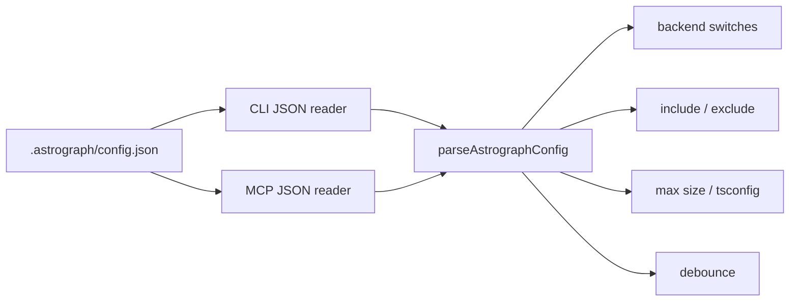

# Configuration and invalidation

Status: mixed
Baseline: `8c6e9ad004a491886fb396cddca0dd617c67f495`
Canonical owner: `packages/core/src/config.ts`

## Purpose

Define configuration ownership, defaults, runtime validation, and when a persisted graph must be rebuilt or re-resolved.

Shared parsing is adopted and described as AS-IS. Convergence on a semantic configuration change is still target behavior, tracked by `DEV-003` and `DEV-006`.

## Current behavior (AS-IS)

`.astrograph/config.json` is optional. CLI and MCP parse its JSON text, then pass
the resulting `unknown` value to the same runtime-free core parser with the
shipped backend IDs. Both receive normalized configuration or the same structured
diagnostics before opening a project. The registry consumes backend
`enabled`/`enricher` flags; scanner consumes include/exclude; indexer consumes
max file size and TypeScript config path; freshness consumes watch debounce.

`computeConfigHash` reads relevant ts/js config, package/lock files, `.gitignore`,
registry version keys, and the normalized semantic configuration. It does not
hash raw `.astrograph/config.json` text, so whitespace and object key order do
not affect graph identity. `watchDebounceMs` is excluded from that semantic
configuration. `sync()` treats a changed hash as modification of every scanned
known file.

## Target behavior (TO-BE)

One shared parser validates shape, ranges, enum values and unknown-policy
decisions before any transport opens the project. Defaults are defined once in
`config.ts` and consumed by core. Each field declares its invalidation domain.

## Canonical parser contract

`parseAstrographConfig(input, { knownBackendIds })` takes `unknown` and returns
either normalized configuration or structured diagnostics. It has no filesystem,
database, watcher, registry-construction, or Bun dependency. Diagnostics have a
stable code, an RFC 6901 JSON Pointer path, and a message. The parser rejects
unknown top-level and backend keys; `kinds` is therefore an explicit error, not
a compatibility alias.

| Field | Default | Validation |
|---|---|---|
| include | every extension claimed by an enabled backend | array of non-empty project-relative globs |
| exclude | `[]` | array of non-empty project-relative globs |
| maxFileSizeBytes | `2_000_000` | safe integer from `1` to `1_073_741_824` |
| watchDebounceMs | `300` | safe integer from `0` to `60_000` |
| tsconfigPath | TypeScript backend discovery | non-empty project-relative string |
| backends | every known backend enabled with its enricher | known IDs; only boolean `enabled` and `enricher` keys |

| Field/input | Target consumer | Invalidation |
|---|---|---|
| JSON whitespace/object-key order | core parser normalization | none |
| include/exclude/.gitignore | scanner | membership reconciliation + full affected backend reload |
| maxFileSizeBytes | eligibility | files crossing threshold enter/leave graph |
| tsconfigPath/tsconfig/jsconfig | TS backend | reload TS project and re-resolve owned/referrer files |
| backend enabled | registry/scanner | add/remove entire backend-owned file set |
| backend enricher | backend/indexer | re-run every owned file to correct states/edges |
| watchDebounceMs | freshness only | no graph semantic invalidation |
| grammar/enricher/compiler version | backend | re-extract/re-resolve owned files |
| package/lock files | module resolution | re-resolve dependency-sensitive backends |

## Invariants

- Invalid configuration fails before indexing and names the field/path.
- CLI and MCP accept/reject the same config and preserve each diagnostic's code, JSON path, and message; only their presentation differs.
- Unimplemented fields are not public contracts.
- Changing an extraction input cannot leave the old graph marked current.
- Operational-only values do not cause unnecessary semantic reindexes.

## Failure and partial states

Malformed JSON and semantically invalid values are different errors. Unknown
backend IDs are errors under the strict forward-compatibility policy. During
invalidation, affected files become non-authoritative before queries can claim
completeness.

## Source evidence

- `packages/core/src/config.ts`: parser, defaults, diagnostics, and semantic projection.
- `packages/core/src/extraction/registry.ts`: backend switches.
- `packages/core/src/indexer.ts`: scan, size and config hash.
- `packages/core/src/freshness.ts`: debounce and excludes.
- `packages/cli/src/commands/shared.ts`, `packages/mcp/src/project.ts`: loaders.

## Known deviations

AG-101 provides the core parser, defaults, diagnostics, and normalized semantic
hash; AG-102 wires it into CLI and MCP. DEV-006 remains open only for the
convergence/invalidation proof, which is scheduled separately. Legacy debounce
documentation was reconciled under resolved `DEV-016`.
