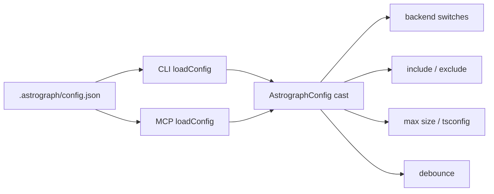

# Configuration and invalidation

Status: mixed
Baseline: `8c6e9ad004a491886fb396cddca0dd617c67f495`
Canonical owner: project composition and indexing

## Purpose

Define configuration ownership, defaults, runtime validation, and when a persisted graph must be rebuilt or re-resolved.

## Current behavior (AS-IS)

`.astrograph/config.json` is optional. CLI and MCP parse JSON independently and cast it to `AstrographConfig`. The registry consumes backend `enabled`/`enricher` flags; scanner consumes include/exclude; indexer consumes max file size and TypeScript config path; freshness consumes watch debounce.

`computeConfigHash` reads relevant ts/js config, package/lock files, `.gitignore`, Astrograph config, and registry version keys. `sync()` treats a changed hash as modification of every scanned known file.

## Target behavior (TO-BE)

One shared parser validates shape, ranges, enum values and unknown-policy decisions before any transport opens the project. Defaults are defined once and consumed by core and docs. Each field declares its invalidation domain.

| Field/input | Target consumer | Invalidation |
|---|---|---|
| include/exclude/.gitignore | scanner | membership reconciliation + full affected backend reload |
| maxFileSizeBytes | eligibility | files crossing threshold enter/leave graph |
| tsconfigPath/tsconfig/jsconfig | TS backend | reload TS project and re-resolve owned/referrer files |
| backend enabled | registry/scanner | add/remove entire backend-owned file set |
| backend enricher | backend/indexer | re-run every owned file to correct states/edges |
| watchDebounceMs | freshness only | no graph semantic invalidation |
| grammar/enricher/compiler version | backend | re-extract/re-resolve owned files |
| package/lock files | module resolution | re-resolve dependency-sensitive backends |

## Invariants

- Invalid configuration fails before indexing and names the field/path.
- CLI and MCP accept/reject the same config.
- Unimplemented fields are not public contracts.
- Changing an extraction input cannot leave the old graph marked current.
- Operational-only values do not cause unnecessary semantic reindexes.

## Failure and partial states

Malformed JSON and semantically invalid values are different errors. Unknown backend IDs should be warnings or errors according to an explicit forward-compatibility policy. During invalidation, affected files become non-authoritative before queries can claim completeness.

## Source evidence

- `packages/core/src/types.ts`: `AstrographConfig`.
- `packages/core/src/extraction/registry.ts`: backend switches.
- `packages/core/src/indexer.ts`: scan, size and config hash.
- `packages/core/src/freshness.ts`: debounce and excludes.
- `packages/cli/src/commands/shared.ts`, `packages/mcp/src/project.ts`: loaders.

## Known deviations

`DEV-006` covers unused `kinds`, missing runtime validation, and transport drift. Legacy debounce documentation was reconciled under resolved `DEV-016`.
