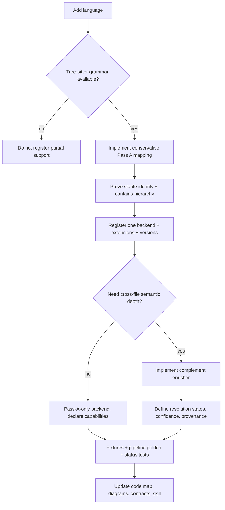

# Language extension guide

Status: target
Baseline: `8c6e9ad004a491886fb396cddca0dd617c67f495`
Canonical owner: extraction architecture

## Purpose

Define the decision-complete path for adding language support without coupling the indexer or product surfaces to the language.

## Target behavior (TO-BE)

## Required implementation surfaces

1. Add the grammar asset and version key in the Tree-sitter grammar loader.
2. Extend path-to-grammar/language mapping.
3. Implement declaration mapping in `TreeSitterParser` or a language-owned mapper extracted from it.
4. Create a `LanguageBackend` with unique ID, language labels, extensions and capabilities.
5. Register it in `createDefaultRegistry` under validated config.
6. If semantic resolution exists, implement an `Enricher` in complement mode and define external/unresolved behavior.
7. Add Pass A identity fixtures and full persisted-pipeline fixtures.
8. Update status/docs/skill language tables.

## Invariants

- No extension is claimed by multiple backends.
- An installed Tree-sitter package alone does not mean the language is supported.
- Pass A emits only identities it can reproduce deterministically.
- A backend declares only edge kinds it can actually emit.
- A missing enricher is honest structural support, not semantic support.
- Bare-name cross-file matches never become resolved solely because a name exists.

## Reusable vs specific parts

| Reusable core | Language-specific |
|---|---|
| registry/routing | CST node kinds and declaration mapping |
| file states and transactions | namespace/module semantics |
| identity hash format | semantic resolver/type checker |
| reconciliation | external symbol naming |
| tool envelope/capability notes | confidence policy for language constructs |
| graph traversal/storage | framework enrichments |

Framework semantics such as Magento XML/DI should be an explicit enrichment layer with its own provenance and capabilities, not hidden inside generic PHP name resolution.

## Required verification

- Extension routing and duplicate ownership.
- Grammar-unavailable status/error path.
- Pass A non-vacuous extraction and ID determinism.
- Pass A subset parity for complement mode.
- Full pipeline persistence and coverage states.
- External, unresolved and ambiguous cases.
- Incremental add/modify/remove convergence.
- Resource disposal and performance budget.

## Source evidence

The current seam is `LanguageBackend`/`LanguageRegistry` in `packages/core/src/types.ts` and `packages/core/src/extraction/registry.ts`. Shipping examples live under `extraction/typescript` and `extraction/php`.

