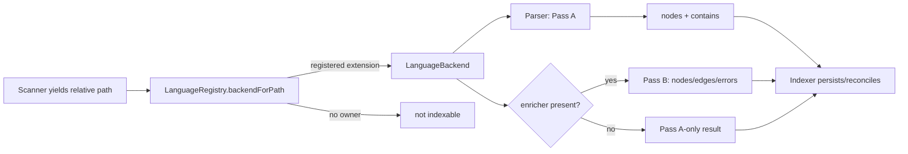

# Language backend contract

Status: mixed
Baseline: `8c6e9ad004a491886fb396cddca0dd617c67f495`
Canonical owner: `packages/core/src/extraction/registry.ts`

## Purpose

Define the boundary between reusable graph indexing and a language backend. A backend owns extension routing, Tree-sitter structural extraction, optional language-aware enrichment, advertised capabilities, and version keys. It does not own scanning, SQLite persistence, coverage calculation, or query semantics.

## Boundaries and responsibilities

| Concern | Owner |
|---|---|
| File extension -> backend | `LanguageRegistry` |
| Structural nodes and `contains` edges | backend `parser` (Tree-sitter Pass A) |
| Language semantics and optional extra nodes | backend `enricher` (Pass B) |
| Node identity/reconciliation and persisted coverage | `Indexer` + storage |
| Grammar loading and availability state | `tree-sitter/grammars.ts` |
| Public result types | `packages/core/src/types.ts`, [contracts](../../contracts.md) |

At the baseline, the default registry registers two backends only: `typescript` for `.ts`, `.tsx`, `.js`, `.jsx`, `.mts`, `.cts`, `.mjs`, `.cjs`, and `php` for `.php`. An extension without a registered backend is not indexed; there is no universal language fallback.

## Current behavior (AS-IS)

`LanguageRegistry` stores backends by ID and extensions in a lower-cased map. `backendForPath()` is the single routing authority, while `allExtensions()` supplies the scanner's indexable suffixes. `createDefaultRegistry()` applies `config.backends.<id>.enabled` and `.enricher` overrides before constructing the two shipping backends.

Every `LanguageBackend` exposes a parser, optional `Enricher`, `BackendCapabilities`, and `versionKeys()`. The registry prefixes each backend's version keys before they participate in index identity. `summary()` reports claimed languages/extensions, enricher mode, capability edge kinds, and grammar availability for status consumers.

The implemented contract still admits `complement`, `replace`, and `none` as `EnricherMode` values. Both shipped enrichers are `complement`; disabling an enricher means `enricher` is absent and only Pass A runs. The current `Indexer` treats `replace` differently from `complement`, despite the target contract below.

## Target behavior (TO-BE)

`ROADMAP.md` §1–2 and §10 lock the intended model: Tree-sitter Pass A always runs and owns structural nodes; an enricher may add edges and insert nodes that Pass A intentionally omitted, but it must not delete Pass A nodes. `docs/contracts.md` §5.1 defines ID-based reconciliation and the `PASS_A_NODE_DROPPED` warning for subset violations.

The implemented `replace` and object-valued `none` modes conflict with that direction (`DEV-007`). The target operational contract is therefore:

- no enricher: Pass A is the final extraction for the file;
- complement enricher: Pass A first, then ID-based updates/inserts plus semantic edges;
- no shipping mode may bypass Pass A or delete a Pass-A node;
- producer provenance belongs to the backend/result rather than being inferred by the indexer.

## Invariants

- One extension has at most one owning backend in a registry.
- A backend advertises only edge kinds it can emit in its active configuration.
- Parser output is per-file, structural, and has no cross-file resolution requirement.
- A complement enricher preserves stable IDs for declarations shared with Pass A.
- Cross-file lookup belongs behind the supplied project-loading interface; it is not a registry concern.
- Grammar unavailability is observable through backend status and becomes extraction errors/file-only output rather than an invented graph.

## Failure and partial states

| Condition | Baseline behavior |
|---|---|
| Unclaimed extension | Scanner/indexer does not route it to extraction. |
| Runtime or grammar unavailable | `TreeSitterParser` returns a file node plus `TREE_SITTER_UNAVAILABLE`/`TREE_SITTER_GRAMMAR_MISSING`. |
| Enricher disabled | Backend capabilities are `contains` only; no Pass B is loaded. |
| Enricher cannot load/resolve a file | It returns its errors/empty semantic result; coverage and tool partiality are owned by core. |
| Pass-A/enricher identity mismatch | Reconciliation keeps Pass-A rows and emits `PASS_A_NODE_DROPPED`. |

## Reusable vs specific parts

| Reusable core seam | Language-specific implementation |
|---|---|
| `LanguageBackend`, `Parser`, `Enricher`, registry, reconciliation types | Grammar selection, AST walk, semantic compiler/name resolver |
| Config/backend enablement and version-key hashing | Extension list, language enum entries, capability edge kinds |
| SQLite lookup callback supplied to enrichers | TypeScript `Program` / PHP FQN and method tables |

## Source evidence

- `packages/core/src/types.ts`: `Parser`, `Enricher`, `LanguageBackend`, `EdgeResolutionResult`, and `EnricherMode`.
- `packages/core/src/extraction/registry.ts`: routing, default construction, status and grammar derivation.
- `packages/core/src/extraction/typescript/backend.ts`: shipping JS/TS complement backend.
- `packages/core/src/extraction/php/backend.ts`: shipping PHP complement backend.
- `packages/core/src/extraction/reconcile.ts`: ID-based subset reconciliation.

## Known deviations

- `DEV-007`: current mode semantics and hard-coded reconciled-node provenance disagree with the locked Pass-A authority model.
- `DEV-008`: resolving all files before a separate edge phase can retain result data beyond a per-file lifetime.
- `DEV-013`: the backend contract has no disposal lifecycle despite PHP owning a WASM parser.

## Related documents

- [Pass A](tree-sitter-pass-a.md)
- [TypeScript enricher](typescript-enricher.md)
- [PHP enricher](php-enricher.md)
- [Language extension guide](../extension-guide.md)
- [Full indexing pipeline](../indexing-pipeline.md)
