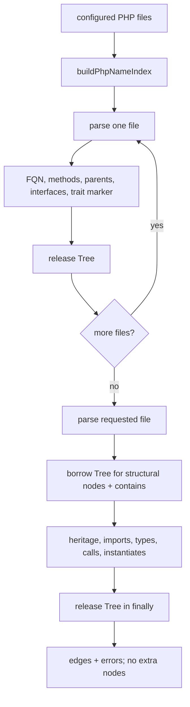
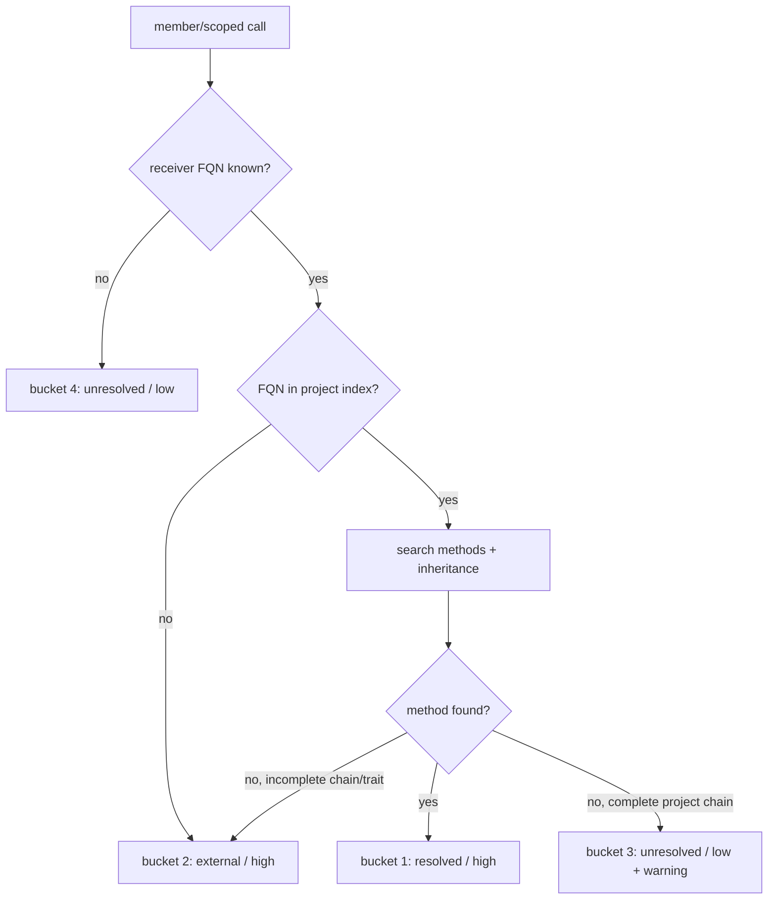

# PHP enricher

Status: mixed
Baseline: `8c6e9ad004a491886fb396cddca0dd617c67f495`
Canonical owner: `packages/core/src/extraction/php/backend.ts`

## Purpose

Describe the PHP complement enricher. It is a name-resolution system built on Tree-sitter, not a PHP type checker: it resolves namespace/FQN aliases, project heritage and type positions, selected calls, and object creation while preserving uncertainty in graph edges.

## Boundaries and responsibilities

Pass A owns PHP structural nodes and `contains`. The PHP enricher owns project-wide FQN/method/heritage indexes and the edges `extends`, `implements`, `imports`, `type_of`, `returns`, `calls`, and `instantiates`. It returns edges only at the baseline, so no PHP Pass-B node reconciliation is needed.

The implementation explicitly excludes framework wiring and dynamic behavior: Magento `di.xml`, factories/proxies, return-type chaining, `__call`, and trait method bodies are not resolved as project methods. A target that cannot be proven is external or unresolved, never a fabricated internal target.

## Current behavior (AS-IS)

`PhpLanguageBackend.loadProject()` resets a `PhpAstCache`, records the project root/file list and SQLite node lookup callback, and clears its name index. Before resolving a file, `ensureNameIndex()` parses every configured PHP file one at a time, contributes compact FQN/method/heritage information from live trees, then releases each tree.

The PHP enricher declares `id: "php-names"` and `provenance: "tree-sitter"`; reconciliation stamps that value, not the TypeScript compiler's, on any node it owns. For the requested file, the backend obtains one live tree, supplies that same tree to `TreeSitterParser.extractNodes()`, then calls `resolvePhpHeritage()` before releasing it in `finally`. PHP edges retain `tree-sitter` provenance because the enricher derives them from Tree-sitter AST evidence.

Name resolution normalizes leading/trailing namespace separators and resolves a type reference by absolute FQN, local alias, or current namespace; it never searches the project by bare type name. The index maps project FQNs to Pass-A node IDs, types to methods, inheritance/interfaces and trait-use markers. Namespace walking supports semicolon and braced namespaces.

Call resolution builds a local receiver type table from typed/promoted properties and typed constructor assignments. It handles `$this`, `self`, `static`, `parent`, selected typed properties, member calls, scoped calls, and `new`. Method lookup follows the indexed inheritance chain with a cycle guard and depth cap. Its four current outcomes are: resolved method, external/incomplete type chain, unresolved method on a complete in-project chain with warning, or unresolved unknown receiver.

## Target behavior (TO-BE)

`ROADMAP.md` §2 and §10 define PHP as a complement name enricher, not a type checker. The approved PHP call-resolution design is `docs/superpowers/specs/2026-07-29-php-call-resolution-design.md`; its four buckets and out-of-scope boundaries are the target scope. The roadmap requires one live tree at a time, Pass-A structural ownership, and at most two PHP parses per file on a full index.

The target must keep type resolution semantic: aliases and namespace rules decide a candidate before project lookup; it must never use a global short-name fallback. It must also preserve an incomplete inheritance chain as external evidence rather than claiming an in-project missing method.

## Invariants

- PHP FQNs are stored without a leading backslash; type references resolve through absolute name, alias, or current namespace.
- Pass-A nodes/`contains` remain in the PHP result; Pass B contributes edges rather than deleting/replacing nodes.
- At most one PHP WASM tree is live in `PhpAstCache` during its own work; a caller releases every parsed file in `finally`.
- Built-in scalar and pseudo-types are not persisted as project type targets; relative class names are resolved through aliases and the active namespace.
- A resolved method edge names an actual indexed method; unknown receivers remain unresolved.
- Namespace scope isolates aliases for each semicolon/braced namespace region.

## Failure and partial states

| Condition | Baseline behavior |
|---|---|
| PHP grammar/parser/source unavailable | No PHP semantic result for the file; Pass A separately reports parser availability. |
| FQN absent from project map | Heritage/import/type or `new` relation is external/high confidence. |
| Empty/unusable type reference | Edge is unresolved/low confidence. |
| Unknown call receiver or chained member call | Bucket 4 unresolved/low confidence. |
| Missing method on complete project chain | Bucket 3 unresolved/low confidence plus `PHP_CALL_UNRESOLVED`. |
| External parent/interface or trait-use | Bucket 2 external/high confidence because lookup completeness is compromised. |

## Reusable vs specific parts

| Reusable core seam | PHP-specific work |
|---|---|
| Backend/enricher contract, Tree-sitter parser, persisted Pass-A node lookup, resolution states | PHP namespaces, `use` aliases, FQN rules, heritage syntax and call receiver rules |
| Stable node IDs, edge/error envelopes, indexer lifecycle | `PhpAstCache`, FQN/method tables, namespace-scope walk and four call buckets |
| Config capability reporting | Magento-oriented explicit non-goals |

## Source evidence

- `packages/core/src/extraction/php/backend.ts`: complement backend lifecycle and Pass-A/tree reuse.
- `packages/core/src/extraction/php/ast-cache.ts`: one-live-tree parser/cache lifecycle.
- `packages/core/src/extraction/php/names.ts`: FQN normalization, aliases, and no bare-name resolution.
- `packages/core/src/extraction/php/resolve.ts`: global name index, namespace scopes, heritage/import/type edges.
- `packages/core/src/extraction/php/calls.ts`: receiver table, lookup buckets, call and instantiation edges.

## Known deviations

- `DEV-009`: PHP class/interface/alias/method lookup keys are currently case-sensitive, despite PHP rules.
- `DEV-010`: mixed grouped `use` declarations can put function/const aliases into the type alias map.
- `DEV-011`: a full index parses PHP in Pass A, name-index construction, and edge resolution; every delta rebuilds the complete name index.
- `DEV-013`: `PhpAstCache.dispose()` exists but no backend/indexer lifecycle calls it.

## Related documents

- [Backend contract](backend-contract.md)
- [Tree-sitter Pass A](tree-sitter-pass-a.md)
- [Full indexing pipeline](../indexing-pipeline.md)
- [Incremental synchronization](../incremental-sync.md)
- [Architecture deviations](../deviations.md)
