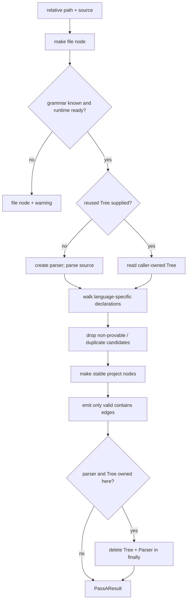

# Tree-sitter Pass A

Status: mixed
Baseline: `8c6e9ad004a491886fb396cddca0dd617c67f495`
Canonical owner: `packages/core/src/extraction/tree-sitter/parser.ts`

## Purpose

Describe the always-structural extraction pass. Pass A turns one supported source file into project nodes and `contains` edges without cross-file resolution. It is the base graph, not a generic semantic parser.

## Boundaries and responsibilities

Pass A owns file/declaration nodes, their stable IDs, source ranges, generated/test classification, Tree-sitter parse errors, and containment. It does **not** emit imports, exports, calls, inheritance, references, type edges, external nodes, or semantic resolution at the baseline. Those are Pass-B responsibilities when a backend enables an enricher.

Supported Tree-sitter grammar targets are TypeScript (`.ts`, `.mts`, `.cts`), TSX (`.tsx`), JavaScript (`.js`, `.mjs`, `.cjs`), JSX (`.jsx`), and PHP (`.php`). Grammar support alone does not claim a language: a registered backend must own the extension.

## Current behavior (AS-IS)

`initTreeSitter()` initializes the WASM runtime and `loadGrammars()` lazily caches each requested grammar. `TreeSitterParser.extractNodes()` first creates a `file` node, then either parses a file with a transient parser/tree or reuses a supplied tree. A parser and owned tree are deleted in `finally`.

For JS/TS, the parser walks statement positions to mirror the TypeScript extractor's declaration scope. It deliberately drops declarations whose identity cannot be proven byte-identical to the compiler result: nested declarations outside statement traversal, duplicate qualified-name/kind candidates, overload signatures/implementations, JSX component ambiguity, accessors, and `import x = require(...)` reconstruction cases.

For PHP, the parser walks PHP declarations and produces the same structural node basis used by the PHP enricher. `PhpLanguageBackend` can pass its currently live PHP tree into `extractNodes()`; the parser then reads it but does not delete it because the backend owns release.

Only emitted nodes participate in `contains`; a parent that was deliberately skipped cannot create a dangling edge. All Pass-A nodes use `metadata.provenance: "tree-sitter"`; all Pass-A edges are resolved/high-confidence `contains` edges with the same provenance.

## Target behavior (TO-BE)

`ROADMAP.md` §1, §2, and §10 state that Tree-sitter always runs and owns structural nodes. `docs/contracts.md` §5 and §5.1 require a conservative Pass-A subset where the same declaration has byte-identical IDs across passes. Enrichers can insert nodes Pass A cannot identify safely but must not delete Pass-A nodes.

The target is not “Tree-sitter for all languages.” It is an open registry whose shipping language set is JS/TS plus PHP. Adding a language requires a backend registration, grammar availability, structural identity rules, capabilities, and tests; see the [extension guide](../extension-guide.md).

## Invariants

- Pass A runs before any semantic enrichment for every indexable file.
- Node IDs hash project, relative file path, kind, qualified name, and locator where required.
- Pass A emits only declarations whose ID parity it can prove for a complement backend.
- `contains` never refers to a node absent from the same `PassAResult`.
- Structural output never fabricates cross-file targets.
- Owned WASM resources are released on parse success and parse failure.

## Failure and partial states

| Condition | Output |
|---|---|
| No grammar for path | File node and warning `TREE_SITTER_UNAVAILABLE`. |
| Runtime uninitialized | File node and warning, not a crash. |
| Requested grammar failed to load | File node and `TREE_SITTER_GRAMMAR_MISSING`. |
| Parse throws/null tree | File node and `TREE_SITTER_PARSE_ERROR`. |
| Ambiguous declaration identity | Candidate omitted intentionally; a complement enricher may insert it. |

This per-file output is not itself a global completeness claim. The indexer records coverage, and query envelopes decide whether pending/parsed files make an answer partial.

## Reusable vs specific parts

| Reusable | Specific |
|---|---|
| Runtime initialization, grammar cache, parser lifecycle, file-node construction, stable ID helper | Grammar mapping and JS/TS versus PHP AST traversal |
| Candidate filtering and containment emission | Declaration kinds and syntax that permit identity parity |
| Error shape and provenance | PHP borrowed-tree integration with `PhpAstCache` |

## Source evidence

- `packages/core/src/extraction/tree-sitter/grammars.ts`: runtime/grammar lifecycle and extension mapping.
- `packages/core/src/extraction/tree-sitter/parser.ts`: file-only failures, ownership rules, candidate filtering, node creation, and `contains` emission.
- `packages/core/src/extraction/shared/language.ts` and `qualified-name.ts`: language and qualified-name support.
- `packages/core/src/extraction/php/backend.ts`: borrowed PHP tree path.

## Known deviations

- `DEV-002`: files rejected by the size limit can still reach Pass B even though Pass A skips them.
- `DEV-007`: `replace` can bypass the locked “Pass A always runs” target.
- `DEV-014`: existing goldens do not cover registry -> indexer -> SQLite as the architecture describes.

## Related documents

- [Backend contract](backend-contract.md)
- [TypeScript enricher](typescript-enricher.md)
- [PHP enricher](php-enricher.md)
- [Full indexing pipeline](../indexing-pipeline.md)
