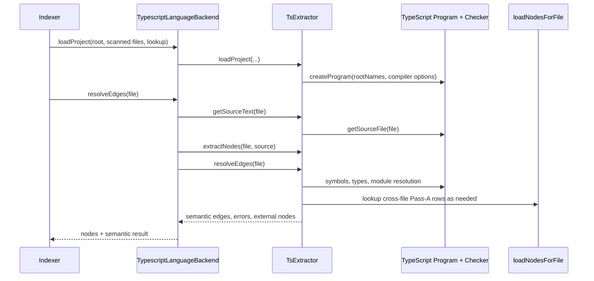

# TypeScript enricher

Status: mixed
Baseline: `8c6e9ad004a491886fb396cddca0dd617c67f495`
Canonical owner: `packages/core/src/extraction/typescript/backend.ts`

## Purpose

Describe the JS/TS complement enricher: it builds a TypeScript compiler `Program`, derives an authoritative declaration view for a file, and resolves semantic edges through its `TypeChecker`.

## Boundaries and responsibilities

The TypeScript backend claims JS/TS extensions and composes `TreeSitterParser` with `TsExtractor`. Pass A emits structural nodes/`contains`; Pass B returns compiler-derived nodes, semantic edges, extraction errors, and external nodes. The generic indexer persists results and reconciles nodes by ID.

The enricher is not a project scanner, package manager, monorepo resolver, or language service. The roadmap limits v1.0 to a single primary `tsconfig.json`/`jsconfig.json`; project references and monorepos are deferred.

## Current behavior (AS-IS)

`TypescriptLanguageBackend` creates a complement `Enricher` unless `backends.typescript.enricher` is false. In Pass-A-only mode it advertises only `contains`; otherwise capabilities include calls, module edges, heritage, type relations, returns, instantiation, overrides, and decorators.

`TsExtractor.loadProject()` locates an explicit config or the nearest supported config, reads compiler options, and creates one `ts.Program`. When the indexer supplies scanned `fileNames`, those normalized files become `rootNames` instead of the full tsconfig enumeration. It records relative/absolute path mappings and accepts `loadNodesForFile` for SQLite-backed cross-file lookups.

For each file, `resolveEdges()` gets the program source, calls `extractNodes()` for the compiler declaration view, then calls `resolveEdgesForFile()` with the `Program`, `TypeChecker`, project-boundary set, in-memory per-file nodes, and storage callback. The resolver emits module, symbol, type, call, CommonJS, export-star and decorator-related edges according to source/checker evidence, preserving `resolved`, `external`, `unresolved`, or `ambiguous` state instead of guessing a target.

## Target behavior (TO-BE)

`ROADMAP.md` §10 requires the compiler to complement Tree-sitter, never delete its nodes, use indexed `rootNames`, resolve CommonJS and `export *`, and keep dynamic non-literal imports honest/unresolved. It also locks SQLite-backed Pass-A rows as the cross-file node authority rather than a whole-project compiler-node dump.

`docs/contracts.md` §5.1 requires Pass A and compiler nodes for the same declaration to use the same ID. Compiler-only declarations such as overloads may be inserted; a Pass-A-only declaration is a visible identity warning rather than a deletion.

## Invariants

- The active backend advertises exactly its enabled semantic edge kinds.
- Configured/scanned project files bound compiler root names when available.
- Pass B returns compiler nodes for ID reconciliation, not compiler `contains` edges.
- Resolved project references point to project nodes; permitted out-of-project targets are represented as external nodes/edges; uncertain targets retain an honest non-resolved state.
- Parser and compiler views must share stable identity for their intersection.

## Failure and partial states

| Condition | Baseline behavior |
|---|---|
| Enricher disabled | Tree-sitter-only backend; no compiler program or semantic edges. |
| Source absent from Program | Empty semantic result for the file. |
| Dynamic import without a literal target | Resolver keeps an unresolved relation rather than inventing a module target. |
| Target outside indexed project | Resolver can return external evidence subject to path-hygiene policy. |
| Multiple/uncertain symbol candidates | Resolver emits `ambiguous` or `unresolved` state. |
| Pass-A identity mismatch | Reconciler preserves structural node and reports `PASS_A_NODE_DROPPED`. |

## Reusable vs specific parts

| Reusable core seam | TypeScript-specific work |
|---|---|
| `Enricher`, `LoadProjectOptions`, `EdgeResolutionResult`, reconciliation | `ts.Program`, `TypeChecker`, compiler AST and module resolution |
| SQLite node callback and persistence | Script-kind detection, TypeScript node identity, export/CommonJS syntax |
| Coverage/provenance/error envelopes | Compiler-backed symbol/type/call interpretation |

## Source evidence

- `packages/core/src/extraction/typescript/backend.ts`: backend composition, capabilities, project loading, Pass-B result.
- `packages/core/src/extraction/typescript/extractor.ts`: program construction, source lookup, compiler node extraction, and resolver inputs.
- `packages/core/src/extraction/typescript/resolver.ts`: semantic edge production and resolution-state handling.
- `packages/core/src/extraction/typescript/identity.ts`: compiler node identity shared with Pass A.
- `packages/core/src/extraction/reconcile.ts`: complement reconciliation.

## Known deviations

- `DEV-007`: modes/provenance do not yet fully express the locked complement-only target.
- `DEV-008`: intermediate result caching can retain enrichment results across phases.
- `DEV-012`: `nodesByFile` keeps project node arrays and `extractNodes()` reparses a source file despite a `Program` source file existing.
- `DEV-014`: fixture tests do not provide end-to-end evidence through registry/indexer/SQLite.

## Related documents

- [Backend contract](backend-contract.md)
- [Tree-sitter Pass A](tree-sitter-pass-a.md)
- [Full indexing pipeline](../indexing-pipeline.md)
- [Storage and graph model](../storage-and-graph-model.md)
