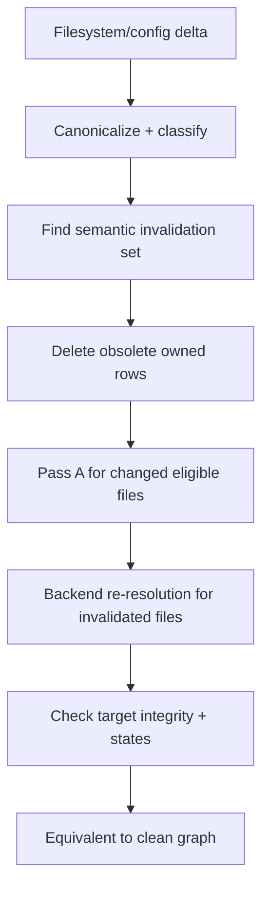

# Incremental synchronization

Status: mixed
Baseline: `8c6e9ad004a491886fb396cddca0dd617c67f495`
Canonical owner: indexing

## Purpose

Define how filesystem/config deltas update the graph and the equivalence expected between incremental and clean indexing.

## Current behavior (AS-IS)

`sync()` performs a scan and content-hash comparison. `syncFiles(events)` merges watcher events and inspects only event paths. Both identify changed files, discover referrers for changed targets, delete removed files, run Pass A on changed files, reconcile/resolve changed files plus known referrers, then heal unresolved edges against new names.

```mermaid
sequenceDiagram
    participant Caller
    participant I as Indexer
    participant DB as QueryBuilder
    participant B as Backends

    Caller->>I: sync() / syncFiles(events)
    I->>I: classify added, modified, removed
    I->>DB: find referrers for changed target IDs
    loop removed files
        I->>DB: capture incoming edges
        I->>DB: delete file/nodes/outgoing edges
        I->>DB: rewrite captured incoming edges unresolved
    end
    I->>B: loadProject(current project files)
    loop changed files
        I->>DB: persist Pass A
    end
    loop changed + direct referrers
        I->>DB: reconcile nodes; replace edges
    end
    I->>DB: heal unresolved edges by targetName
```

Full `sync()` treats a config-hash change as modification of every scanned known file. `syncFiles()` does not persist project metadata and calculates its current project set from DB plus additions.

## Target behavior (TO-BE)

For a fixed filesystem and config:

```text
normalize(cleanIndex(state)) == normalize(index(oldState) + applyDelta(old→state))
```

Removal and addition must re-run semantic resolution rather than mutate trust based only on a name. Referrer closure must cover every derived edge affected by a removed or changed type/module, including language-specific inheritance chains. Configuration invalidation must be handled consistently by full scan and watcher-driven paths.



## Event semantics

| Event | Required graph effect |
|---|---|
| Add | Create file/structural nodes; re-resolve references that may bind to it. |
| Modify | Replace owned structural/semantic data; re-resolve impacted referrers. |
| Remove | Delete owned rows; re-resolve incoming references and derived relationships. |
| Rename | Equivalent to remove old + add new; stable IDs are not expected across file-path changes. |
| Config/backend change | Recompute index membership and invalidate every affected backend project. |
| Oversized transition | Enter/leave recorded skipped state without passing oversized content to backends. |

## Invariants

- No edge points to a deleted node.
- “Resolved” is never assigned by bare-name coincidence.
- Event coalescing is deterministic: unlink dominates stale change for the same path.
- Backend project state reflects the post-event project set before resolution.
- Sync results return sorted, unique paths.

## Failure and partial states

A failed delta must leave affected files visibly non-authoritative and must not claim global freshness. FreshnessManager serializes batches through `syncQueue`; its error callback is responsible for surfacing an unavailable watcher/sync state to the transport.

## Source evidence

- `packages/core/src/indexer.ts`: `sync`, `syncFiles`, referrer lookup, removal downgrade and healing.
- `packages/core/src/freshness.ts`: event filtering, debounce, queue and close.
- `packages/core/src/adapters/bun/watcher.ts`: concrete watcher.

## Known deviations

See `DEV-001`, `DEV-002`, `DEV-003`, and `DEV-011`.

