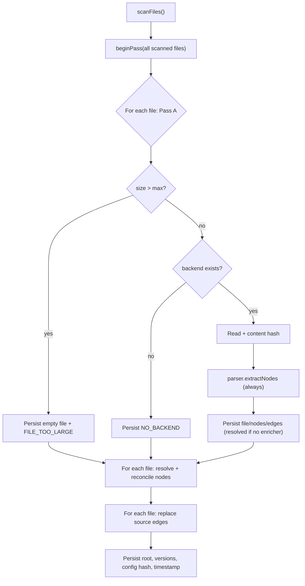
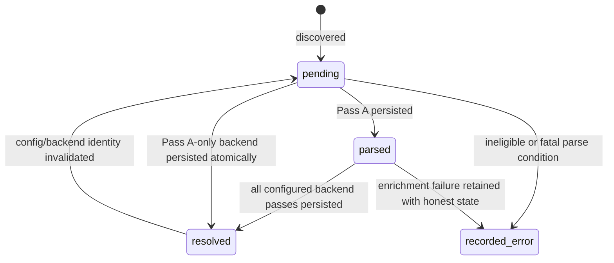

# Full indexing pipeline

Status: mixed
Baseline: `8c6e9ad004a491886fb396cddca0dd617c67f495`
Canonical owner: indexing

## Purpose

Specify how `Indexer.indexAll` converts the current filesystem/config into persisted files, nodes, edges, coverage, and project metadata.

## Current behavior (AS-IS)

`Indexer.indexAll` scans indexable extensions, calls `beginPass(files)`, performs Pass A for every scanned file, reconciles all enricher node views, resolves all enricher edges, then persists config/version metadata.

`beginPass` groups all input files by backend and calls each enricher's `loadProject`. `resolveFor` memoizes one `EdgeResolutionResult` per file so the reconciliation phase and edge phase share it, and returns `undefined` when the backend has no enricher. Pass A runs for every eligible claimed file — there is no branch that skips it. A backend without an enricher reaches `resolved` during Pass A. An enriched file reaches `resolved` after its edges are written; its reconciled nodes are stamped with `Enricher.provenance`, declared by the producing backend.

## Target behavior (TO-BE)

The full index is a convergent rebuild of the logical graph for the current filesystem and configuration:

1. Scan and stat files.
2. Partition into eligible, oversized, and unsupported/error records.
3. Reconcile stored files with the scan; remove records outside the current set.
4. Load each backend project with eligible owned files only.
5. Run Pass A for eligible files and persist structural truth.
6. Run complement enrichers with bounded result lifetime.
7. Persist semantic edges and file states transactionally.
8. Validate no dangling resolved targets and persist config identity.

The target's “recorded_error” is conceptual: the public schema currently has only three states, so the final mapping must be decided before implementation rather than invented by documentation.

## Invariants

- Scanner/backend ownership and `status.backends` agree.
- Oversized content is never passed to a parser/enricher.
- Pass A node IDs are stable and are never silently deleted by a complement enricher.
- Every resolved edge target exists or is represented according to external-path policy.
- A clean full index and a reused-DB full index normalize to the same graph.
- Progress totals describe the actual eligible/recorded work consistently.

## Failure and partial states

Extraction errors are attached to `FileRecord.errors`. A missing or failed grammar produces at least a file node when possible. Partiality derives from persisted file states and backend capabilities, not from whether loops completed without throwing.

## Reusable vs specific parts

Indexer orchestration, transactions, reconciliation and coverage are reusable. Parsing, project loading and edge resolution belong to backends. File I/O, hashing and storage are injected adapters.

## Source evidence

- `packages/core/src/indexer.ts`: `indexAll`, `beginPass`, `indexFilePassA`, `indexFileReconcile`, `indexFileResolveEdges`.
- `packages/core/src/extraction/reconcile.ts`: subset reconciliation.
- `packages/core/src/db/queries.ts`: persisted operations and coverage.

## Known deviations

`DEV-002`, `DEV-003`, and `DEV-008` are direct mismatches in this flow.

