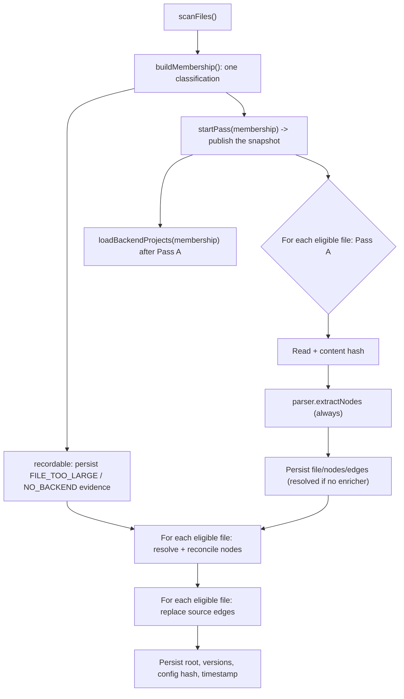
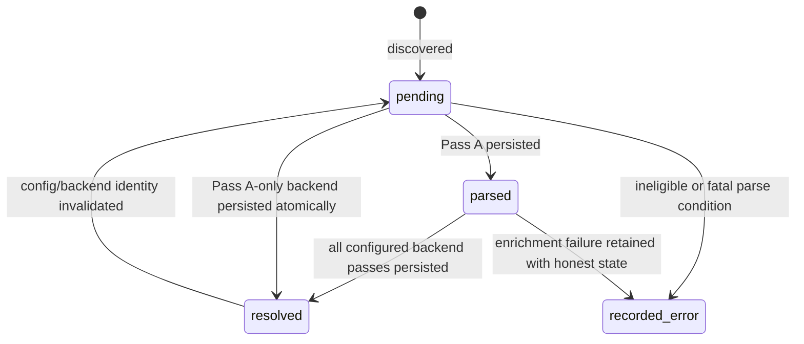

# Full indexing pipeline

Status: mixed
Baseline: `8c6e9ad004a491886fb396cddca0dd617c67f495`
Canonical owner: indexing

## Purpose

Specify how `Indexer.indexAll` converts the current filesystem/config into persisted files, nodes, edges, coverage, and project metadata.

## Current behavior (AS-IS)

`Indexer.indexAll` classifies membership once, then delegates to `runPass()` — the same reconciler `sync()` and `syncFiles()` use. `runPass` marks the pass in flight, calls `startPass(membership)`, captures invalidation evidence, retires what no longer belongs, performs Pass A over changed files, calls `loadBackendProjects(membership)`, re-resolves the affected set, and only then persists config/version metadata.

A full index over a **reused** database first retires everything the current membership no longer accepts — deleted files, newly excluded paths, files that grew past the limit, extensions whose backend was disabled — using `retireFile()`, the same policy both sync paths use. Without that step a row kept answering queries long after its file stopped belonging to the project. The identity (`configHash` and the version keys) is written last, in the same transaction that marks the pass complete, so a crashed run can never present itself as current: `passState` stays `in_progress`, `status` reports `indexInterrupted`, and the next pass forces Pass A rather than trusting content hashes.

`classifyProject()` computes membership once (contracts §13) and every later phase reads it. Pass A no longer re-checks the size limit or backend ownership, and nothing re-groups files by walking the registry — both were second definitions of eligibility, and they were how an oversized file stayed inside a backend's `loadProject` set while being excluded from Pass A. `startPass(membership)` publishes the snapshot before Pass A; `loadBackendProjects(membership)` runs *after* Pass A and hands each enricher only its eligible files, because a backend builds its project view from persisted Pass A rows. `resolveFor` memoizes one `EdgeResolutionResult` per file so the reconciliation phase and edge phase share it, and returns `undefined` when the backend has no enricher. Pass A runs for every eligible claimed file — there is no branch that skips it. A backend without an enricher reaches `resolved` during Pass A. An enriched file reaches `resolved` after its edges are written; its reconciled nodes are stamped with `Enricher.provenance`, declared by the producing backend.

## Target behavior (TO-BE)

The full index is a convergent rebuild of the logical graph for the current filesystem and configuration:

1. Scan and stat files.
2. Partition into eligible, oversized, and unsupported/error records.
3. Reconcile stored files with the scan; remove records outside the current set.
4. Load each backend project with eligible owned files only.
5. Run Pass A for eligible files and persist structural truth.
6. Run complement enrichers with bounded result lifetime.
7. Persist semantic edges and file states transactionally.
8. Validate no dangling resolved targets and persist config identity.

The target's “recorded_error” is conceptual: the public schema currently has only three states, so the final mapping must be decided before implementation rather than invented by documentation.

## Invariants

- Scanner/backend ownership and `status.backends` agree.
- Oversized content is never passed to a parser/enricher.
- Pass A node IDs are stable and are never silently deleted by a complement enricher.
- Every resolved edge target exists or is represented according to external-path policy.
- A clean full index and a reused-DB full index normalize to the same graph.
- Progress totals describe the actual eligible/recorded work consistently.

## Failure and partial states

Extraction errors are attached to `FileRecord.errors`. A missing or failed grammar produces at least a file node when possible. Partiality derives from persisted file states and backend capabilities, not from whether loops completed without throwing.

## Reusable vs specific parts

Indexer orchestration, transactions, reconciliation and coverage are reusable. Parsing, project loading and edge resolution belong to backends. File I/O, hashing and storage are injected adapters.

## Source evidence

- `packages/core/src/indexer.ts`: `indexAll`, `sync`, `syncFiles`, `runPass`, `startPass`, `loadBackendProjects`, `indexFilePassA`, `indexFileReconcile`, `indexFileResolveEdges`, `retireFile`.
- `packages/core/src/extraction/reconcile.ts`: subset reconciliation.
- `packages/core/src/db/queries.ts`: persisted operations and coverage.

## Known deviations

`DEV-002`, `DEV-003`, and `DEV-008` are direct mismatches in this flow.

