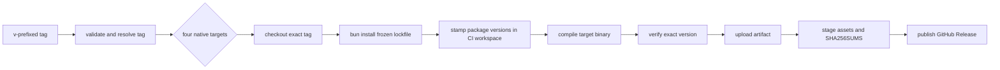
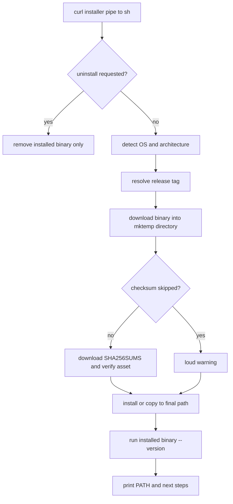
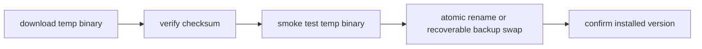

# Distribution and delivery

Status: mixed
Baseline: `8c6e9ad004a491886fb396cddca0dd617c67f495`
Canonical owner: CLI distribution and documentation site

## Purpose

This document records how Astrograph is built, released, installed, and published at the baseline. It supplements the user-facing [installation guide](../../install.md); it does not assert that the current pipeline is release-ready.

## Current behavior (AS-IS)

### Build outputs

The root package exposes a host build (`bun run build`) and an all-target build (`bun run build:all`). Both compile `packages/cli/src/bin/astrograph.ts` into standalone Bun binaries. The all-target command names four assets:

| Asset | Target |
|---|---|
| `astrograph-darwin-arm64` | Apple Silicon macOS |
| `astrograph-darwin-x64` | Intel macOS |
| `astrograph-linux-x64` | x86-64 Linux |
| `astrograph-linux-arm64` | ARM64 Linux |

`bun run release:checksums` writes SHA-256 entries for `dist/astrograph-*`. The normal build only produces the host `dist/astrograph`; it is the artifact used by CI smoke testing and `install:local`.

### Release workflow

The release workflow starts on a `v*` tag or a manually supplied existing tag. It validates a `v`-prefixed semver form, checks out that exact tag in a native four-platform matrix, installs with the frozen lockfile, stamps package versions from the tag in the CI workspace, compiles one binary per runner, and verifies its exact `astrograph --version` output.

Artifacts lose their executable bit during upload, so the release job restores mode `755` before generating checksums and publishing. The workflow does not independently run typecheck, Biome, or tests at tag time; it relies on the tag having passed normal CI beforehand.

Source evidence: `.github/workflows/release.yml`, `package.json`.

### Installer

`apps/site/public/install.sh` is the single installer source. It is strict POSIX `sh`, and CI parses it with `dash` plus ShellCheck. It obtains the latest GitHub Release tag unless `ASTROGRAPH_VERSION` is pinned, detects Darwin/Linux and x64/arm64 (including Rosetta on Apple Silicon), downloads the corresponding binary, verifies `SHA256SUMS` by default, then installs to `${HOME}/.local/bin/astrograph` with mode `755`.

Failures during download, empty asset detection, unsupported OS/architecture, absent/mismatched checksum, or failed post-install smoke test terminate the script. Temporary downloads are removed via traps. `ASTROGRAPH_SKIP_CHECKSUM=1` intentionally permits an unverified install with a conspicuous warning.

The final installation path is overwritten before the smoke test. Therefore a failed smoke test can leave a bad replacement in place rather than the prior working binary. This is an operational limitation, not a claim that checksum verification failed.

Source evidence: `apps/site/public/install.sh`, `docs/install.md`.

### Documentation site

The static documentation/landing site is built from `apps/site` and deployed to GitHub Pages. Its workflow runs on `main` when site/workflow/root-lockfile inputs change, runs `bun install` without `--frozen-lockfile`, builds the site, ensures `out/.nojekyll`, uploads the static output, and deploys it through GitHub Pages.

The site delivers `public/install.sh`, so the site deployment and the installer source share one tracked file. Publishing the site does not create a binary release; releasing a binary does not deploy the site.

### Delivery invariants

- Release assets are generated from the tagged source, not the default branch during manual dispatch.
- Every published binary has a release checksum entry; the installer refuses a missing entry by default.
- The installer does not modify agent configuration or project indexes. Those remain explicit CLI actions.
- Binary removal is limited to the configured installation path; project `.astrograph/` directories are independent state.
- CI validates the installer as POSIX shell syntax; it does not perform a live network installation.

## Failure and recovery states

| Stage | AS-IS failure response | Recovery owner |
|---|---|---|
| Invalid tag | release workflow stops before build | release author fixes/creates tag |
| Native build/smoke failure | that matrix leg fails; release job cannot run | release author investigates target |
| Checksum unavailable/mismatch | installer refuses installation unless explicitly overridden | installer user fixes source/tag or knowingly opts out |
| Unsupported host | installer exits before download | installer user builds from source or uses supported host |
| Post-install smoke failure | installer exits after final path was overwritten | installer user must restore/reinstall a known-good binary |
| Site build/deploy failure | Pages deployment does not advance | site maintainer fixes build/workflow |

## Target behavior (TO-BE)

The target delivery path treats the artifact as verified before it replaces a working install, and gives release workflows the same quality evidence as the commit they publish.

Recommended target controls are:

- run or require successful typecheck, static check, tests, and compile evidence for the exact tag before publishing;
- smoke-test the downloaded temporary binary before replacing the final path, then perform an atomic rename or preserve a rollback copy;
- pin or otherwise govern third-party GitHub Action revisions as part of supply-chain policy;
- make the site installation page and `docs/install.md` part of a link/content consistency check.

These controls are recommendations, not current behavior. They must not be represented as shipped guarantees.

## Known deviations

- **DEV-017 — static quality:** a distribution workflow declares a Biome gate through normal CI, but baseline static checks are not green; tag publishing does not re-run that gate.
- **DEV-013 — resource lifecycle:** distribution invokes a compiled process which must still follow the core close/cleanup contract; backend disposal remains incomplete in the current runtime.
- **DEV-015 — eval validity:** release/installer confidence is independent from the current eval harness. Eval output is not release certification.

## Related documents

- [Installation guide](../../install.md)
- [Site design](../../site.md) — supporting design history
- [Testing and evaluation](testing-and-evaluation.md)
- [Lifecycle and resources](lifecycle-and-resources.md)
- [Known deviations](../deviations.md)
