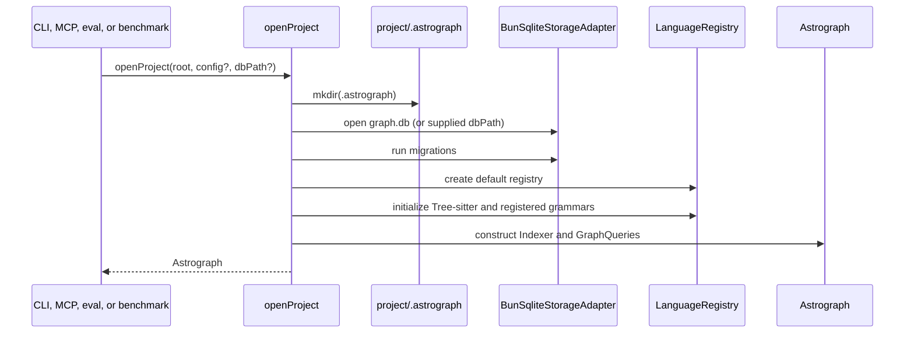
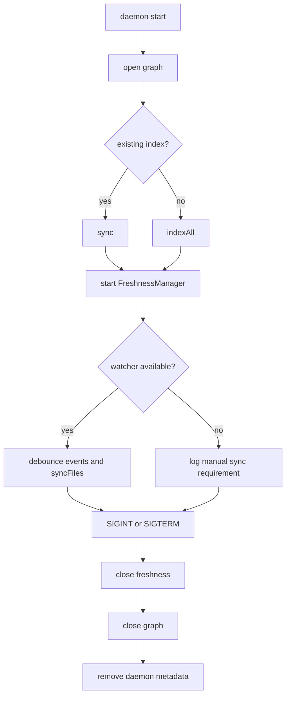
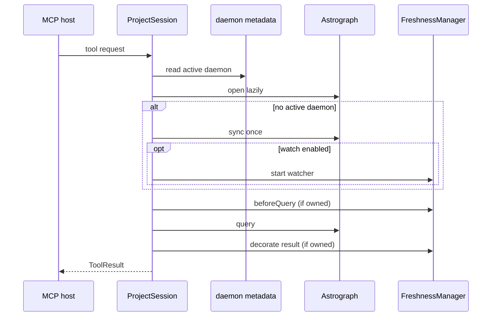
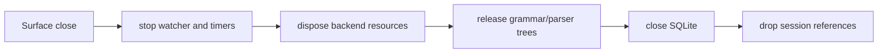

# Lifecycle and resources

Status: mixed
Baseline: `8c6e9ad004a491886fb396cddca0dd617c67f495`
Canonical owner: core runtime and operations

## Purpose

This document defines who creates, owns, and closes Astrograph runtime resources. It covers a one-shot CLI command, the CLI daemon, and an MCP `ProjectSession`; it does not define graph extraction semantics.

## Boundaries and responsibilities

| Resource | Created by | Owner while active | Current close path |
|---|---|---|---|
| `.astrograph/` directory | `openProject` | project filesystem | persists intentionally |
| SQLite adapter / database handle | `openProject` | `Indexer` | `Indexer.close()` |
| registry, grammars, scanner, filesystem and hasher | `openProject` | `Indexer` / query facade | no explicit disposal required today |
| `Astrograph` facade | `openProject` | surface session/command | `Astrograph.close()` |
| `FreshnessManager` and watcher handle | daemon or watched MCP session | that surface | `FreshnessManager.close()` |
| PHP live Tree | `PhpAstCache.parse()` | PHP enricher call site | `release()` / `clear()` |
| PHP WASM parser | `PhpAstCache` | PHP backend/cache | no reachable production shutdown path |

`openProject` is the sole Bun composition root: it normalizes the root, creates `.astrograph/`, opens/migrates SQLite, creates the default language registry, initializes only its Tree-sitter grammars, and wires `Indexer` plus `GraphQueries` into `Astrograph`.

Source evidence: `packages/core/src/adapters/bun/project.ts`, `packages/core/src/astrograph.ts`, `packages/core/src/indexer.ts`.

## Current behavior (AS-IS)

### Opening a graph

An explicitly supplied `dbPath` changes only the SQLite location. `openProject` still creates `<root>/.astrograph`; therefore an eval or benchmark using a temporary/in-memory database may create that directory in the target repository.

Once SQLite opens, `openProject` owns that handle until it returns an `Astrograph`. If migrations,
registry construction, or grammar initialization fails first, it closes storage exactly once and
rethrows the original initialization error. A cleanup failure never replaces that error.

### One-shot commands

Commands open a graph, perform one action, and close it in their own cleanup path. `astrograph init` owns its progress reporter, runs an initial `indexAll`, then closes both reporter and graph. This means one-shot surfaces do not retain a watcher or database handle after command completion.

### CLI daemon

The daemon first opens a graph. If coverage already exists, it calls `sync`; otherwise it performs the initial full index. It then creates a `BunWatcher` and wraps it with `FreshnessManager`.

`FreshnessManager` filters non-indexable and excluded paths, coalesces events by relative path, serializes sync calls, and defaults to a 300 ms debounce. A failed sync restores the event batch to pending state and invokes the surface error callback. A watcher that cannot start makes future decorated results partial and adds a freshness note; it does not stop the daemon.

Source evidence: `packages/cli/src/commands/daemon.ts`, `packages/core/src/freshness.ts`, `packages/core/src/adapters/bun/watcher.ts`.

### MCP sessions

`ProjectSession` opens lazily on the first tool call. It finds an existing `.astrograph` ancestor, loads its config, and checks daemon metadata. If no active daemon is recorded, it runs `graph.sync()` before serving the first request. With `watch: true`, it owns a `FreshnessManager`; with an active daemon it neither syncs nor creates a watcher, avoiding two freshness owners.

Before every watched request, `runTool` flushes queued changes. After the tool returns, it decorates the result with pending-file and watcher-unavailable partiality. `ProjectSession.close()` closes freshness before graph/storage.

Source evidence: `packages/mcp/src/project.ts`, `packages/mcp/src/daemon.ts`, `packages/mcp/src/server.ts`.

### Resource invariants

- A `FreshnessManager` has at most one watch handle and serializes its own syncs.
- Pending events are only cleared after they are drained into a queued sync; failed batches are restored.
- The manager is the owner of its timer and watcher handle. `close()` cancels both and ignores future event recording, but does not await a sync already queued or running.
- `PhpAstCache` retains no more than one live Tree and releases the previous Tree before parsing another file.
- `Astrograph.close()` delegates to `Indexer.close()`, which currently closes SQLite only.
- Before `Astrograph` exists, `openProject` closes an opened SQLite adapter if any later initialization
  step fails, preserving the original failure for the caller.

## Failure and partial states

| Condition | AS-IS response | Consequence |
|---|---|---|
| Migration, registry, or grammar initialization fails after SQLite opens | `openProject` closes the adapter once and rethrows the original error | no orphaned project-storage handle and no masked diagnostic |
| Missing `.astrograph` for MCP | `MissingIndexError` asks for `astrograph init` | no graph is opened |
| Watcher start failure | manager stays available as a decorator but marks results partial | caller must manually sync or restore watch support |
| Background sync failure | events return to pending; callback logs the error | subsequent queries may force a retry through `beforeQuery()` |
| Close while a sync is queued/running | close returns synchronously and storage may close while that sync continues | shutdown can race graph work; see `DEV-018` |
| Process signal in daemon | watcher then graph are closed; metadata removed | orderly CLI-daemon shutdown |
| Fatal daemon startup/runtime error | metadata removed and graph closed | command exits nonzero |
| PHP parser lifetime after graph close | parser may remain allocated | see `DEV-013` |

## Target behavior (TO-BE)

The target lifecycle is explicit and ordered: stop accepting watch work, flush/cancel timers, release backend-owned native/WASM resources, then close storage. Backends and/or enrichers need a lifecycle seam so registry ownership can be disposed once per project.

This is not implemented. `PhpAstCache.dispose()` exists but neither `Astrograph.close()` nor `Indexer.close()` reaches it, and the public backend contract has no general `dispose()` hook. This is tracked as [DEV-013](../deviations.md#architecture-deviations).

## Known deviations

- **DEV-013 — resource lifecycle:** native/WASM PHP parser disposal is not connected to normal project shutdown. Required verification is repeated open/close exercising release of backend resources.
- **DEV-018 — freshness shutdown:** synchronous surface close does not await the freshness sync queue before closing storage. Required verification blocks a sync, initiates close, and proves storage closes only after graph work settles.
- **DEV-017 — static quality:** lifecycle source and its operational surfaces remain subject to the repository-wide static-check backlog; green typechecking alone is not the operational quality gate.

## Related documents

- [Project lifecycle](../project-lifecycle.md)
- [Incremental sync](../incremental-sync.md)
- [Configuration and invalidation](../configuration-and-invalidation.md)
- [MCP surface](../surfaces/mcp.md)
- [Known deviations](../deviations.md)
