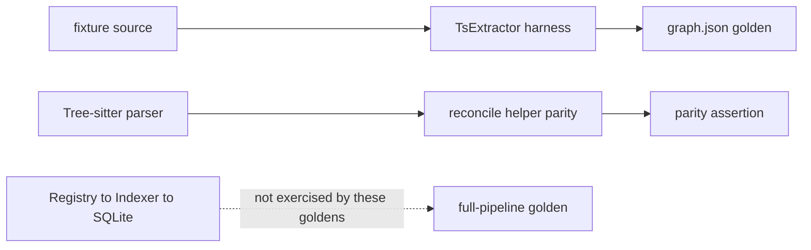
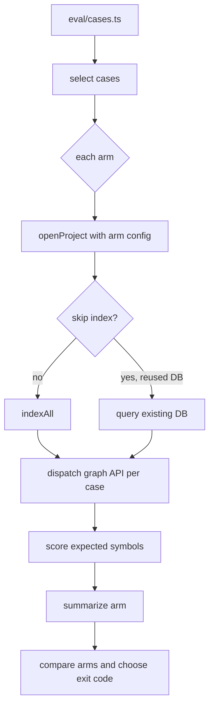
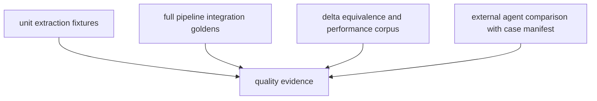

# Testing and evaluation

Status: mixed
Baseline: `8c6e9ad004a491886fb396cddca0dd617c67f495`
Canonical owner: quality and evaluation

## Purpose

This document separates the checks that exist at the baseline from the desired quality strategy. It deliberately does not promote fixture plans, performance targets, or agent-comparison claims into facts merely because legacy documentation describes them.

## Current behavior (AS-IS)

### Commands and CI

| Command | Current implementation | Automation |
|---|---|---|
| `bun test` | Bun tests across the workspace | CI runs it; repository convention requires the user to run tests for an implementation task |
| `bun run typecheck` | package typechecks plus `tsconfig.eval.json` | CI runs it |
| `bun run check` | `biome check .` | Required gate in CI and at tag time. Implemented against a green baseline; execution evidence is owed by the owner, see DEV-017 |
| `bun run build` | compiles the host-platform CLI binary | CI runs it then invokes `--version` and `--help` |
| `bun run bench -- <repo>` | measures process RSS while one in-memory full index runs | manual only |
| `bun run eval [repo]` | runs a predefined Astrograph-query suite through one or more backend arms | manual only |

The CI workflow installs a frozen lockfile, then runs typecheck, Biome, tests, host binary compilation/smoke tests, and POSIX-shell syntax/ShellCheck for the installer. It does not run `bench` or `eval`.

Source evidence: `package.json`, `.github/workflows/ci.yml`, `bench/rss.ts`, `eval/runner.ts`.

### Tests and fixtures actually present

The core package contains unit/integration-style Bun tests for indexing, resolution, query behavior, freshness, SQLite queries, registry/configuration, and PHP extraction. The fixture harness under `packages/core/__fixtures__/` reads `graph.json` goldens. It directly constructs the TypeScript extractor; the parity test separately compares Tree-sitter and TypeScript extraction through reconciliation helpers.

That arrangement is useful for deterministic extractor behavior, but it is **not** a persisted, full-pipeline golden: it does not prove the route `LanguageRegistry → Indexer → SQLite → query facade`, nor all coverage states and backend configurations.

The real fixture tree currently has `graph.json` snapshots; the `pass-a.json` and `externals.json` matrix described in legacy `docs/testing.md` is not present. Likewise, legacy references to parked/nonexistent fixture groups should not be read as suite coverage.

### Exact test and fixture inventory

This manifest complements the production [code map](../code-map.md). CLI tests cover dispatch, formatting, daemon/single-writer behavior, install integration, style, and smoke paths. Core tests cover adapters, storage, indexing, extraction/resolution, queries, freshness/progress, IDs, and test helpers. Core fixtures contain the extractor inputs and stored goldens described above. MCP tests cover formatting, freshness/session behavior, project resolution, and tool mapping.

- `packages/cli/src/__tests__/args.test.ts`
- `packages/cli/src/__tests__/daemon.test.ts`
- `packages/cli/src/__tests__/format.test.ts`
- `packages/cli/src/__tests__/install.test.ts`
- `packages/cli/src/__tests__/single-writer.test.ts`
- `packages/cli/src/__tests__/smoke.test.ts`
- `packages/cli/src/__tests__/style.test.ts`
- `packages/core/__fixtures__/basic/__golden__/graph.json`
- `packages/core/__fixtures__/basic/sample.ts`
- `packages/core/__fixtures__/decorators/__golden__/graph.json`
- `packages/core/__fixtures__/decorators/sample.ts`
- `packages/core/__fixtures__/exports/__golden__/graph.json`
- `packages/core/__fixtures__/exports/sample.ts`
- `packages/core/__fixtures__/extraction.test.ts`
- `packages/core/__fixtures__/functions/__golden__/graph.json`
- `packages/core/__fixtures__/functions/sample.ts`
- `packages/core/__fixtures__/harness.ts`
- `packages/core/__fixtures__/imports/barrel/__golden__/graph.json`
- `packages/core/__fixtures__/imports/barrel/consumer.ts`
- `packages/core/__fixtures__/imports/barrel/extra.ts`
- `packages/core/__fixtures__/imports/barrel/index.ts`
- `packages/core/__fixtures__/imports/barrel/origin.ts`
- `packages/core/__fixtures__/imports/commonjs/__golden__/graph.json`
- `packages/core/__fixtures__/imports/commonjs/main.js`
- `packages/core/__fixtures__/imports/commonjs/utils.js`
- `packages/core/__fixtures__/imports/dynamic-literal/__golden__/graph.json`
- `packages/core/__fixtures__/imports/dynamic-literal/consumer.ts`
- `packages/core/__fixtures__/imports/dynamic-literal/module.ts`
- `packages/core/__fixtures__/imports/type-only/__golden__/graph.json`
- `packages/core/__fixtures__/imports/type-only/consumer.ts`
- `packages/core/__fixtures__/imports/type-only/types.ts`
- `packages/core/__fixtures__/jsx/__golden__/graph.json`
- `packages/core/__fixtures__/jsx/sample.tsx`
- `packages/core/__fixtures__/overloads/__golden__/graph.json`
- `packages/core/__fixtures__/overloads/sample.ts`
- `packages/core/__fixtures__/pass-a-parity.test.ts`
- `packages/core/__fixtures__/php/calls/Child.php`
- `packages/core/__fixtures__/php/calls/Contract.php`
- `packages/core/__fixtures__/php/calls/Dep.php`
- `packages/core/__fixtures__/php/calls/Dynamic.php`
- `packages/core/__fixtures__/php/calls/MissingCall.php`
- `packages/core/__fixtures__/php/calls/ParentService.php`
- `packages/core/__fixtures__/php/calls/VendorLeaf.php`
- `packages/core/__fixtures__/php/calls/Worker.php`
- `packages/core/__fixtures__/php/calls/__golden__/graph.json`
- `packages/core/__fixtures__/php/heritage/AbsoluteIface.php`
- `packages/core/__fixtures__/php/heritage/AbstractModel.php`
- `packages/core/__fixtures__/php/heritage/BaseService.php`
- `packages/core/__fixtures__/php/heritage/Child.php`
- `packages/core/__fixtures__/php/heritage/Cleanup.php`
- `packages/core/__fixtures__/php/heritage/DataObject.php`
- `packages/core/__fixtures__/php/heritage/DeepChild.php`
- `packages/core/__fixtures__/php/heritage/Grouped.php`
- `packages/core/__fixtures__/php/heritage/LocalContract.php`
- `packages/core/__fixtures__/php/heritage/Thing.php`
- `packages/core/__fixtures__/php/heritage/__golden__/graph.json`
- `packages/core/__fixtures__/php/types/Deps.php`
- `packages/core/__fixtures__/php/types/Worker.php`
- `packages/core/__fixtures__/php/types/__golden__/graph.json`
- `packages/core/__fixtures__/resolution/ambiguous/__golden__/graph.json`
- `packages/core/__fixtures__/resolution/ambiguous/sample.ts`
- `packages/core/__fixtures__/update-goldens.ts`
- `packages/core/src/__tests__/progress.test.ts`
- `packages/core/src/adapters/bun/glob.test.ts`
- `packages/core/src/db/queries.test.ts`
- `packages/core/src/extraction/php/ast-cache.test.ts`
- `packages/core/src/extraction/php/backend.e2e.test.ts`
- `packages/core/src/extraction/php/calls.test.ts`
- `packages/core/src/extraction/php/heritage.test.ts`
- `packages/core/src/extraction/php/names.test.ts`
- `packages/core/src/extraction/php/types.test.ts`
- `packages/core/src/extraction/reconcile.test.ts`
- `packages/core/src/extraction/registry.test.ts`
- `packages/core/src/extraction/tree-sitter/parser.test.ts`
- `packages/core/src/extraction/typescript/resolver/utils.test.ts`
- `packages/core/src/ids.test.ts`
- `packages/core/src/indexer.test.ts`
- `packages/core/src/query/graph-queries.test.ts`
- `packages/core/src/resolver.test.ts`
- `packages/core/src/search/fts-query.test.ts`
- `packages/core/src/testing/graph-assertions.test.ts`
- `packages/core/src/testing/normalize.test.ts`
- `packages/mcp/src/__tests__/format.test.ts`
- `packages/mcp/src/__tests__/freshness.test.ts`
- `packages/mcp/src/__tests__/project.test.ts`
- `packages/mcp/src/__tests__/tools.test.ts`

### RSS benchmark

`bench/rss.ts` takes a repository path, opens the project against `:memory:`, runs one `indexAll`, samples process RSS every 50 ms, writes `docs/benchmarks/latest.json`, and exits nonzero only over twice its 1.5 GiB target. It records wall-clock elapsed time but does not gate throughput, query latency, a 2k-file corpus, or incremental sync.

The benchmark mutates the target repository only by allowing `openProject` to ensure `<repo>/.astrograph/` exists; its graph database itself is in memory. The generated report is a working artifact, not a stable historical benchmark ledger.

### Eval harness

The eval runner executes built-in cases from `eval/cases.ts`. Its cases are authored against Astrograph itself. Each arm opens the selected repository with the arm configuration, indexes into a temporary database unless `--db` is supplied, calls supported graph APIs, and aggregates recall, MRR, latency, payload count, coverage, partiality, and errors.

Supported command options include `--arm/--arms`, `--db`, `--skip-index`, `--fresh`, `--allow-partial`, `--min-recall`, `--only`, and `--json`. An arm is an Astrograph backend-configuration ablation, not an agent operating under a grep/Read control condition.

Current gates reject runner errors, mean recall below the supplied threshold, and partial cases unless explicitly allowed. They do **not** reject an individual failed case when the suite mean stays high. A built-in callers expectation also points to an already deleted PHP stub path. Supplying an arbitrary repository path is accepted even though the built-in expected symbols are repository-specific.

Source evidence: `eval/runner.ts`, `eval/cases.ts`, `eval/scoring.ts`, `eval/types.ts`.

## Invariants

- Tests are never run autonomously by an implementing agent; the user executes requested test commands and provides results.
- CI checks source changes on pushes to `main` and pull requests; eval and RSS benchmark remain opt-in.
- Eval results record partiality and coverage returned by the queried tool. A low partial count is only as trustworthy as the query coverage model.
- A temporary eval database is removed in `finally`; a caller-supplied database is preserved.
- Benchmark and eval are not release-quality proof by themselves.

## Failure interpretation

| Signal | What it proves | What it does not prove |
|---|---|---|
| Unit/extractor golden passes | covered function or extraction output matches its asserted fixture | registry/storage/query integration or behavior outside the fixture |
| CI binary smoke test passes | compiled host binary starts and reports help/version | cross-platform release assets or installer rollback |
| RSS benchmark passes | sampled one-process full-index RSS stayed under its wide gate | peak memory on a representative 2k-file repo, incremental cost, or latency budget |
| Eval mean-recall gate passes | mean score and configured partial/error gates passed | every case passed, a foreign repo was measured meaningfully, or Astrograph beat grep/Read |

## Target behavior (TO-BE)

The target quality model has four distinct layers:

1. extractor unit fixtures for stable language-specific output;
2. registry-to-SQLite integration goldens covering Pass-A-only and each enricher configuration;
3. deterministic full-index versus delta-sync equivalence plus performance probes with representative corpora;
4. an external, versioned case manifest for a separately-run agent comparison against a defined grep/Read baseline.

The intended eval gate is every required case passing, an explicit case-manifest/repository match, and transparent distinction between backend ablation and agent effectiveness. This target is not implemented.

## Known deviations

- **DEV-014 — golden integration:** current snapshots bypass registry, indexer, SQLite, and persisted resolution/coverage behavior. Preserve extractor tests but add genuine pipeline goldens.
- **DEV-015 — eval validity:** exit status ignores individual case failures; a stale case is present; built-in cases are not portable despite accepting a repository argument. Do not claim agent-vs-grep results from this runner.
- **DEV-017 — static quality:** Biome is gated in CI and at tag time, and the tracked sources were brought to a green state with narrow, documented fixture exceptions. The row stays `implemented, awaiting verification` until the owner runs `bun run check` and reports the output; typecheck and static check are still reported independently.

## Related documents

- [Legacy testing document](../../testing.md) — supporting/historical, not authoritative for existing coverage
- [Indexing pipeline](../indexing-pipeline.md)
- [Incremental sync](../incremental-sync.md)
- [Query and honesty](../query-and-honesty.md)
- [Known deviations](../deviations.md)
