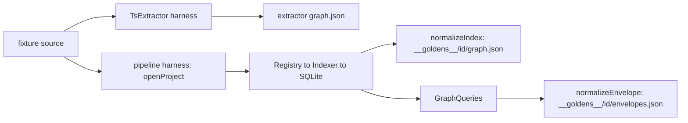
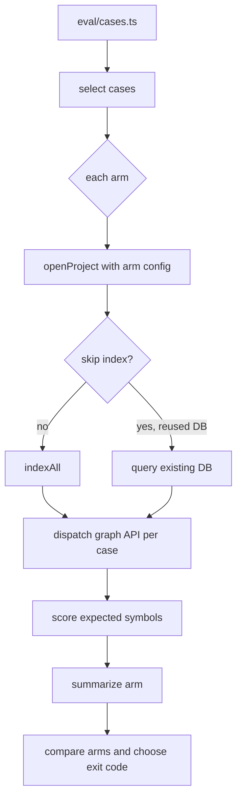
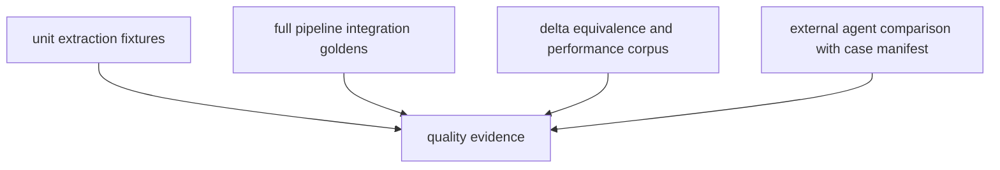

# Testing and evaluation

Status: mixed
Baseline: `8c6e9ad004a491886fb396cddca0dd617c67f495`
Canonical owner: quality and evaluation

## Purpose

This document separates the checks that exist at the baseline from the desired quality strategy. It deliberately does not promote fixture plans, performance targets, or agent-comparison claims into facts merely because legacy documentation describes them.

## Current behavior (AS-IS)

### Commands and CI

| Command | Current implementation | Automation |
|---|---|---|
| `bun test` | Bun tests across the workspace | CI runs it; repository convention requires the user to run tests for an implementation task |
| `bun run typecheck` | package typechecks plus `tsconfig.eval.json` | CI runs it |
| `bun run check` | `biome check .` | Required gate in CI and at tag time. Implemented against a green baseline; execution evidence is owed by the owner, see DEV-017 |
| `bun run build` | compiles the host-platform CLI binary | CI runs it then invokes `--version` and `--help` |
| `bun run bench -- <repo>` | measures process RSS while one in-memory full index runs | manual only |
| `bun run eval [repo]` | runs a predefined Astrograph-query suite through one or more backend arms | manual only |

The CI workflow installs a frozen lockfile, then runs typecheck, Biome, tests, host binary compilation/smoke tests, and POSIX-shell syntax/ShellCheck for the installer. It does not run `bench` or `eval`.

Source evidence: `package.json`, `.github/workflows/ci.yml`, `bench/rss.ts`, `eval/runner.ts`.

### Tests and fixtures actually present

The core package contains unit/integration-style Bun tests for indexing, resolution, query behavior, freshness, SQLite queries, registry/configuration, and PHP extraction. There are now **two** fixture families, and the difference between them is the point:

- **Extractor fixtures** (`packages/core/__fixtures__/<name>/__golden__/graph.json`, driven by `__fixtures__/harness.ts`) construct `TsExtractor` directly. They pin what the extractor computes, and they stay: a failure there names one pass of one backend, which is the fastest thing to read when extraction changes.
- **Production-pipeline fixtures** (`packages/core/__fixtures__/pipeline/`, driven by `pipeline/harness.ts`) run the real composition root `openProject` over a temporary project, and snapshot what SQLite holds afterwards plus what the query facade claimed about it. They pin the route `LanguageRegistry → Indexer → SQLite → GraphQueries/Astrograph` (AG-302 through AG-307).



The real fixture tree currently has `graph.json` snapshots; the `pass-a.json` and `externals.json` matrix described in legacy `docs/testing.md` is not present. Likewise, legacy references to parked/nonexistent fixture groups should not be read as suite coverage.

### Exact test and fixture inventory

This manifest complements the production [code map](../code-map.md). CLI tests cover dispatch, formatting, daemon/single-writer behavior, install integration, style, and smoke paths. Core tests cover adapters, storage, indexing, extraction/resolution, queries, freshness/progress, IDs, and test helpers. Core fixtures contain the extractor inputs and stored goldens described above. MCP tests cover formatting, freshness/session behavior, project resolution, and tool mapping.

- `packages/cli/src/__tests__/args.test.ts`
- `packages/cli/src/__tests__/daemon.test.ts`
- `packages/cli/src/__tests__/format.test.ts`
- `packages/cli/src/__tests__/install.test.ts`
- `packages/cli/src/__tests__/single-writer.test.ts`
- `packages/cli/src/__tests__/smoke.test.ts`
- `packages/cli/src/__tests__/style.test.ts`
- `packages/core/__fixtures__/basic/__golden__/graph.json`
- `packages/core/__fixtures__/basic/sample.ts`
- `packages/core/__fixtures__/decorators/__golden__/graph.json`
- `packages/core/__fixtures__/decorators/sample.ts`
- `packages/core/__fixtures__/exports/__golden__/graph.json`
- `packages/core/__fixtures__/exports/sample.ts`
- `packages/core/__fixtures__/extraction.test.ts`
- `packages/core/__fixtures__/functions/__golden__/graph.json`
- `packages/core/__fixtures__/functions/sample.ts`
- `packages/core/__fixtures__/harness.ts`
- `packages/core/__fixtures__/pipeline/assert.ts`
- `packages/core/__fixtures__/pipeline/compare.ts`
- `packages/core/__fixtures__/pipeline/failure-fixtures.ts`
- `packages/core/__fixtures__/pipeline/failure-injection.ts`
- `packages/core/__fixtures__/pipeline/failure.test.ts`
- `packages/core/__fixtures__/pipeline/goldens.ts`
- `packages/core/__fixtures__/pipeline/harness.ts`
- `packages/core/__fixtures__/pipeline/jsts-fixtures.ts`
- `packages/core/__fixtures__/pipeline/jsts.test.ts`
- `packages/core/__fixtures__/pipeline/manifests.ts`
- `packages/core/__fixtures__/pipeline/mixed-fixtures.ts`
- `packages/core/__fixtures__/pipeline/mixed.test.ts`
- `packages/core/__fixtures__/pipeline/php-fixtures.ts`
- `packages/core/__fixtures__/pipeline/php.test.ts`
- `packages/core/__fixtures__/pipeline/probes.ts`
- `packages/core/__fixtures__/pipeline/route-scripts.ts`
- `packages/core/__fixtures__/pipeline/routes.test.ts`
- `packages/core/__fixtures__/pipeline/routes.ts`
- `packages/core/__fixtures__/pipeline/smoke-fixture.ts`
- `packages/core/__fixtures__/pipeline/smoke.test.ts`
- `packages/core/__fixtures__/pipeline/update-goldens.test.ts`
- `packages/core/__fixtures__/pipeline/update-goldens.ts`
- `packages/core/__fixtures__/pipeline/__goldens__/<fixture-id>/graph.json` and `envelopes.json`, one directory per fixture id in the matrix above
- `packages/core/__fixtures__/imports/barrel/__golden__/graph.json`
- `packages/core/__fixtures__/imports/barrel/consumer.ts`
- `packages/core/__fixtures__/imports/barrel/extra.ts`
- `packages/core/__fixtures__/imports/barrel/index.ts`
- `packages/core/__fixtures__/imports/barrel/origin.ts`
- `packages/core/__fixtures__/imports/commonjs/__golden__/graph.json`
- `packages/core/__fixtures__/imports/commonjs/main.js`
- `packages/core/__fixtures__/imports/commonjs/utils.js`
- `packages/core/__fixtures__/imports/dynamic-literal/__golden__/graph.json`
- `packages/core/__fixtures__/imports/dynamic-literal/consumer.ts`
- `packages/core/__fixtures__/imports/dynamic-literal/module.ts`
- `packages/core/__fixtures__/imports/type-only/__golden__/graph.json`
- `packages/core/__fixtures__/imports/type-only/consumer.ts`
- `packages/core/__fixtures__/imports/type-only/types.ts`
- `packages/core/__fixtures__/jsx/__golden__/graph.json`
- `packages/core/__fixtures__/jsx/sample.tsx`
- `packages/core/__fixtures__/overloads/__golden__/graph.json`
- `packages/core/__fixtures__/overloads/sample.ts`
- `packages/core/__fixtures__/pass-a-parity.test.ts`
- `packages/core/__fixtures__/php/calls/Child.php`
- `packages/core/__fixtures__/php/calls/Contract.php`
- `packages/core/__fixtures__/php/calls/Dep.php`
- `packages/core/__fixtures__/php/calls/Dynamic.php`
- `packages/core/__fixtures__/php/calls/MissingCall.php`
- `packages/core/__fixtures__/php/calls/ParentService.php`
- `packages/core/__fixtures__/php/calls/VendorLeaf.php`
- `packages/core/__fixtures__/php/calls/Worker.php`
- `packages/core/__fixtures__/php/calls/__golden__/graph.json`
- `packages/core/__fixtures__/php/heritage/AbsoluteIface.php`
- `packages/core/__fixtures__/php/heritage/AbstractModel.php`
- `packages/core/__fixtures__/php/heritage/BaseService.php`
- `packages/core/__fixtures__/php/heritage/Child.php`
- `packages/core/__fixtures__/php/heritage/Cleanup.php`
- `packages/core/__fixtures__/php/heritage/DataObject.php`
- `packages/core/__fixtures__/php/heritage/DeepChild.php`
- `packages/core/__fixtures__/php/heritage/Grouped.php`
- `packages/core/__fixtures__/php/heritage/LocalContract.php`
- `packages/core/__fixtures__/php/heritage/Thing.php`
- `packages/core/__fixtures__/php/heritage/__golden__/graph.json`
- `packages/core/__fixtures__/php/types/Deps.php`
- `packages/core/__fixtures__/php/types/Worker.php`
- `packages/core/__fixtures__/php/types/__golden__/graph.json`
- `packages/core/__fixtures__/resolution/ambiguous/__golden__/graph.json`
- `packages/core/__fixtures__/resolution/ambiguous/sample.ts`
- `packages/core/__fixtures__/update-goldens.ts`
- `packages/core/src/__tests__/progress.test.ts`
- `packages/core/src/adapters/bun/glob.test.ts`
- `packages/core/src/db/queries.test.ts`
- `packages/core/src/extraction/php/ast-cache.test.ts`
- `packages/core/src/extraction/php/backend.e2e.test.ts`
- `packages/core/src/extraction/php/calls.test.ts`
- `packages/core/src/extraction/php/heritage.test.ts`
- `packages/core/src/extraction/php/names.test.ts`
- `packages/core/src/extraction/php/types.test.ts`
- `packages/core/src/extraction/reconcile.test.ts`
- `packages/core/src/extraction/registry.test.ts`
- `packages/core/src/extraction/tree-sitter/parser.test.ts`
- `packages/core/src/extraction/typescript/resolver/utils.test.ts`
- `packages/core/src/ids.test.ts`
- `packages/core/src/indexer.test.ts`
- `packages/core/src/query/graph-queries.test.ts`
- `packages/core/src/resolver.test.ts`
- `packages/core/src/search/fts-query.test.ts`
- `packages/core/src/testing/graph-assertions.test.ts`
- `packages/core/src/testing/normalize.test.ts`
- `packages/mcp/src/__tests__/format.test.ts`
- `packages/mcp/src/__tests__/freshness.test.ts`
- `packages/mcp/src/__tests__/project.test.ts`
- `packages/mcp/src/__tests__/tools.test.ts`

### RSS benchmark

`bench/rss.ts` takes a repository path, opens the project against `:memory:`, runs one `indexAll`, samples process RSS every 50 ms, writes `docs/benchmarks/latest.json`, and exits nonzero only over twice its 1.5 GiB target. It records wall-clock elapsed time but does not gate throughput, query latency, a 2k-file corpus, or incremental sync.

The benchmark mutates the target repository only by allowing `openProject` to ensure `<repo>/.astrograph/` exists; its graph database itself is in memory. The generated report is a working artifact, not a stable historical benchmark ledger.

### Eval harness

The eval runner executes built-in cases from `eval/cases.ts`. Its cases are authored against Astrograph itself. Each arm opens the selected repository with the arm configuration, indexes into a temporary database unless `--db` is supplied, calls supported graph APIs, and aggregates recall, MRR, latency, payload count, coverage, partiality, and errors.



Supported command options include `--arm/--arms`, `--db`, `--skip-index`, `--fresh`, `--allow-partial`, `--min-recall`, `--only`, and `--json`. An arm is an Astrograph backend-configuration ablation, not an agent operating under a grep/Read control condition.

Current gates reject runner errors, mean recall below the supplied threshold, and partial cases unless explicitly allowed. They do **not** reject an individual failed case when the suite mean stays high. A built-in callers expectation also points to an already deleted PHP stub path. Supplying an arbitrary repository path is accepted even though the built-in expected symbols are repository-specific.

Source evidence: `eval/runner.ts`, `eval/cases.ts`, `eval/scoring.ts`, `eval/types.ts`.

## The 0.1-C graph oracle

`packages/core/src/testing/normalize.ts` is the **sole** comparison boundary for every 0.1-C
pipeline golden and convergence claim (AG-301). There is deliberately no second normalizer: a
golden and a convergence assertion that disagree about what counts as equal prove nothing about
each other. `normalizeIndex()` is what every fixture, four-route convergence test and
delta-versus-full assertion must compare through.

### Three snapshot kinds, three purposes

| Snapshot | Function | What it proves |
|---|---|---|
| **Graph** | `normalizeIndex(source, { rootPath })` | Persisted truth: files, nodes, edges, states, diagnostics. Compared with `toEqual`. |
| **Query envelope** | `normalizeEnvelope(meta, { rootPath })` | What a *question* claimed about that graph: coverage, `partial`, domain, reasons, evidence. |
| **Digest** | `digest(snapshot, hasher)` | A single comparable value for a corpus that cannot be committed. |

The envelope is a separate type on purpose. `ToolMeta` is not persisted truth — it is computed per
query from a completeness domain and legitimately differs between two questions asked of the same
index. Folding it into the graph snapshot would make an envelope difference look like a graph
divergence, and would break a graph golden because a query's wording changed. A fixture that wants
both takes two snapshots and compares them independently.

Digests exist for the maintainer certification path in `DEV-014`, where the corpus is proprietary
and no golden can be checked in. `digest()` runs the *same* normalization as a committed fixture
and folds in `ORACLE_SCHEMA_VERSION`, so a digest computed under a different schema cannot silently
compare against one recorded under another. Publish digests, counts and redacted discrepancy
categories — never the database or the payloads.

### Stability rules

Every field of `Node`, `Edge`, `FileRecord` and `ExtractionError` carries an explicit rule in
`NODE_FIELD_STABILITY`, `EDGE_FIELD_STABILITY`, `FILE_FIELD_STABILITY` and
`EXTRACTION_ERROR_FIELD_STABILITY`. They are typed `Record<keyof T, FieldStability>`, so adding a
field to a persisted shape fails to compile until it is classified.

Exactly four fields are removed, each with a written reason (`volatileFields()`):

| Field | Reason |
|---|---|
| `Node.updatedAt` | Wall-clock stamp of when the row was written. |
| `Edge.id` | SQLite autoincrement rowid: insertion order in one database, not a fact about the relation. |
| `FileRecord.modifiedAt` | Filesystem mtime; a checkout changes it without changing the file. |
| `FileRecord.indexedAt` | Wall-clock stamp of when indexing ran. |

Everything else is retained, including node IDs, `resolutionState`, `confidence`, `provenance`,
external nodes, file `state` and the full diagnostic list. **Nothing is dropped to make two outputs
agree.** The only other transformation is removing the project root from paths and from free text
inside diagnostics and envelope notes — two runs in different temporary directories are the same
graph, and a path outside the project is left alone because it is identical on the next run.

### Ordering

Nodes, edges, files and diagnostics are sorted by **total** orders. A partial order leaves ties to
a stable sort, which means SQLite row order decides them — so two indexes with identical content
but different insertion history would normalize differently and the oracle would report a
divergence that is not one. Edge order ends at canonicalized `metadata`; node order ends at the
node ID.

## The 0.1-C production-pipeline fixtures

`packages/core/__fixtures__/pipeline/` is the AS-IS full-pipeline evidence `DEV-014` asked for. Every
fixture runs `openProjectWithDependencies` — the same composition root `openProject` uses — over a
freshly created temporary directory, and compares two independent snapshots taken through
[the 0.1-C graph oracle](#the-01-c-graph-oracle).

### Layout

| Path | What it holds |
|---|---|
| `pipeline/harness.ts` | `PipelineSession`, `withPipeline`, `runCleanPipeline`: the temporary project, its SQLite file, and the two snapshot functions. |
| `pipeline/*-fixtures.ts`, `pipeline/smoke-fixture.ts` | Manifests: files, backend modes, configuration, probes. |
| `pipeline/manifests.ts` | The registry of every fixture that owns a golden. The updater validates ids against it. |
| `pipeline/probes.ts` | Named questions, one per completeness domain. |
| `pipeline/compare.ts` | Identity-based comparison producing attributable discrepancies. |
| `pipeline/goldens.ts` | Reading and writing expectations. The read path has no update branch. |
| `pipeline/assert.ts` | `expectMatchesGolden`, `expectSnapshotsAgree`. |
| `pipeline/failure-injection.ts` | AG-306 registry overrides, reachable only through the adapter-local seam. |
| `pipeline/routes.ts`, `pipeline/route-scripts.ts` | The AG-307 mutation-script format and its matrix. |
| `pipeline/__goldens__/<fixture-id>/graph.json` | Reviewed persisted graph truth. |
| `pipeline/__goldens__/<fixture-id>/envelopes.json` | Reviewed probe outcomes. Absent when a fixture declares no probes. |

### What is pinned, and why

Determinism comes from pinning six things: the clock (`PIPELINE_PINNED_NOW`), the project root (a
fresh `mkdtemp`, whose prefix the oracle strips), the project name (`openProject` fixes it to `root`,
and node ids hash it), the configuration (declared per manifest, never inherited from the
repository), the database (one file per session, deleted with the temporary tree), and the
**type environment** (`HERMETIC_TSCONFIG`, written into every temporary root). The root lives
outside the repository deliberately: a fixture rooted inside `packages/core` would discover this
checkout's `tsconfig.json` and the goldens would encode its compiler options — and the hermetic
tsconfig closes the subtler half of the same hole, since TypeScript resolves automatic `@types` from
the process working directory rather than from the project root it was handed.

The filesystem, glob scanner, SQLite, tree-sitter, TypeScript program and both shipped backends are
the production ones. The only test seams are `createRegistry` and `loadGrammars` on
`OpenProjectDependencies` — adapter-local, absent from every barrel, and used by the AG-306 fixtures
alone, for the failure conditions that have no other trigger.

### The implemented matrix

| Fixture id | Backends | Evidence |
|---|---|---|
| `smoke` | typescript enriched | The harness reaches registry, Indexer, SQLite and GraphQueries; a divergence fails. |
| `jsts-enriched` | typescript enriched | TS/JS/TSX ownership, barrel resolution, calls, instantiation, and all four resolution states: `resolved`, `ambiguous` (a merged declaration, with its candidates), and `unresolved` (an `any` receiver, a non-literal `import()`, an uninstalled module). |
| `jsts-external-package` | typescript enriched | An installed dependency: the external declaration is persisted as an external node with a root-relative path, and the relation resolves to it as `external`. |
| `jsts-pass-a-only` | typescript Pass A only | Containment only, with envelopes that say why; Pass A ids are a subset of the enriched ones. |
| `php-calls-enriched` | php enriched | STEP 3 receiver buckets, unresolved and dynamic calls, a vendor parent, mixed-case lookup. |
| `php-calls-pass-a-only` | php Pass A only | The same sources with declarations and containment only. |
| `php-heritage-enriched` | php enriched | Plain, aliased, grouped and absolute `use`; same-namespace resolution; a class absent from disk. |
| `php-types-enriched` | php enriched | Type-position edges for imported types; scalars produce nothing. |
| `php-grouped-use-mixed` | php enriched | DEV-010 AS-IS: mixed grouped `use` (`use Vendor\{Bar, function baz, const QUX}`) contaminates the type alias map; `new baz()` and `QUX $flag` are class-shaped `external` relations. Repairing DEV-010 must change this golden. |
| `mixed-enriched` | both enriched | Exclusive ownership, homonyms, and no bare-name cross-language resolution. |
| `mixed-php-pass-a-only` | ts enriched, php Pass A | A capability reduction in one backend does not degrade the other. |
| `mixed-ts-pass-a-only` | ts Pass A, php enriched | The mirror configuration. |
| `failure-coverage-gaps` | typescript enriched | Oversized file, owned extension with no grammar (`TREE_SITTER_UNAVAILABLE`), ambiguous and unresolved relations. |
| `failure-grammar-missing` | typescript Pass A only | A recognized extension whose grammar fails to load: file-only node, persisted `TREE_SITTER_GRAMMAR_MISSING`. |
| `failure-backend-extraction` | typescript enriched | An injected Pass A failure whose diagnostic survives the enricher recovering the content. |
| `failure-backend-extraction-pass-a` | typescript Pass A only | The same failure with nothing to fall back on: a visibly known-and-empty file. |
| `failure-unowned-and-disabled` | typescript enriched, php disabled, `include` naming `.txt` | An extension no shipped backend claims, next to a disabled backend's extension: both `NO_BACKEND`, with distinct messages. |
| `failure-backend-disabled` | php enriched, then disabled, default configuration | Nodes retired, the `NO_BACKEND` record kept with its actionable message, and global envelopes incomplete. |
| `failure-capability-gap` | typescript Pass A only | A healthy project where a relational question is unsupported and discovery is complete. |

The AG-307 rows in `route-scripts.ts` carry **no** golden. Each of the eighteen rows is run through
four routes — clean full index, reused full index, `sync()` and `syncFiles()` — and compared against
a clean index of the same final state, so there is one expectation per row rather than four. The
matrix covers add, modify, delete and rename; both directions across the size limit; an `exclude`
change and, separately, an `include` change, because the two reach membership by different code
paths; enricher enable; backend disable and enable; JS/TS-only, PHP-only and mixed projects;
Pass-A-only in both languages; and an aborted pass followed by recovery and an ordinary edit — that
last one as a full four-route row, so recovery is held to the same expectation as everything else.

Two guards keep the matrix from going vacuous: every row must contain a resolved cross-file relation
at one of its two endpoints (not both — a deletion row ends with the relation deliberately demoted),
and every row's two endpoint graphs must actually differ.

### What the fixtures found, and what they still pin

Building the oracle changed the product twice and corrected the oracle three times. Both product
changes are recorded here because a reader comparing an old golden to a new one needs to know which
diffs were fixes.

**Fixed: a disabled backend now leaves evidence.** The scanner's extension list came from
`registry.allExtensions()`, which omits a disabled backend, so with PHP switched off no `.php` path
was ever scanned; `buildMembership` classified the persisted path `out_of_scope` rather than
`backend_disabled`, and `out_of_scope` is deliberately not recordable. The rows were deleted, and a
project whose entire PHP half was unindexed answered **every query with `partial: false`** —
indistinguishable from a project with no PHP. `openProject` now builds the scanner from every
*shipped* backend's extensions, enabled or not, which feeds the `backend_disabled` →
`NO_BACKEND` path that `classifyPath` and `eligibilityEvidence` already implemented and nothing
could reach. Scanning is all that changed: such a file is recorded with zero nodes and never reaches
a parser. `failure-backend-disabled` and the AG-305 disable tests hold it in place.

**Fixed: the harness was not hermetic, and it made a wrong answer look right.** `ts.createProgram`
had no `types`/`typeRoots`, so TypeScript resolved `@types` from the *process* working directory —
this repository — and pulled `bun-types` and `@types/bun` into every fixture's program. An
`import { join } from "node:path"` in a project with no dependencies therefore came back
`external`/`high` ("the declaration is known, it is simply not yours") when the honest answer is
`unresolved`/`low`. A fixture asserting that an unprovable target stays unproven was passing because
the harness had quietly made it provable, and the recorded goldens encoded whichever type packages
this checkout happened to have installed. Every fixture now gets `HERMETIC_TSCONFIG`
(`types: []` and `typeRoots: []`); real module resolution is untouched, so a package genuinely
installed inside a fixture's own root still resolves — that is what `jsts-external-package` proves.
It is the fixture that persists an *external node* for an installed dependency. Other fixtures also
contain `external` *relations* without that node class: PHP goldens record vendor parents and
unresolvable FQNs as `external` edges with a null target, and `php-grouped-use-mixed` pins DEV-010
the same way. Those are a different claim from "the declaration lives in `node_modules` and was
written as a node".

**Fixed in the oracle:** the `node_modules` path rewrite ran before root removal and collapsed
`<root>/packages/a/node_modules/x` and `.../b/node_modules/x` onto one path; `stripRoot` was an
unanchored substring replace, so with a root of `/tmp/ag` the message `in /tmp/agent/x.ts` became
`in ent/x.ts` — the same snapshot as a genuinely different diagnostic; and `compareEdges` had no
unique final key, leaving two edges that differ only in `metadata` tied and ordered by SQLite row
order. Each has a regression test in `normalize.test.ts`.

**Still open, and pinned as AS-IS:**

1. **The reason for a disabled backend is imprecise.** The envelope now reports
   `coverage_incomplete`, because coverage is what the unindexed files move. The honest reason is a
   capability limit — "the PHP backend is switched off" — and `capabilityReasons` cannot produce it:
   `registry.summary()` lists only constructed backends, so a disabled one is invisible to it. Doing
   this properly needs a shipped-but-disabled capability table (`DEV-004`/`NEW-002`). The owner
   accepted this as later work; it does not block 0.1-C. Recorded in the
   [0.1-C review](0.1-c-review.md).
2. **PHP lookup is still case-sensitive.** `php-calls-enriched` contains a `MIXEDCASE` type hint for
   an in-project `MixedCase` class. PHP class names are case-insensitive, so that is a real
   in-project relation; the shipped lookup keys classify it as `external`. This is `DEV-009`, still
   open, and the golden pins its cost. AG-304's matrix row is therefore only half met: display
   casing is preserved, the lookup is not case-insensitive.
3. **Mixed grouped `use` contaminates the type alias map.** `php-grouped-use-mixed` contains
   `use Vendor\{Bar, function baz, const QUX}`. Correct PHP imports only `Bar` as a class;
   Astrograph copies every grouped clause into the type alias map, so `new baz()` and `QUX $flag`
   become class-shaped `external` relations. This is `DEV-010`, still open, and the golden pins its
   cost. Repairing it must change that golden.

### Updating a golden

```sh
bun packages/core/__fixtures__/pipeline/update-goldens.ts --list
bun packages/core/__fixtures__/pipeline/update-goldens.ts jsts-enriched php-calls-enriched
```

The updater is the **only** writer. Its guardrails, each covered by a test in
`pipeline/update-goldens.test.ts`:

- No fixture named fails with exit code 1. There is no update-all default.
- An unknown id fails and prints the known ids.
- `--all` requires `--i-reviewed-every-fixture`, so rewriting every reviewed expectation is a
  deliberate act recorded in shell history.
- An unrecognized option fails instead of being ignored.
- Output is deterministic: two-space JSON, one trailing newline, oracle key order.
- The inventory test, driven from `allPipelineManifests()`, requires `graph.json` for every known
  fixture and `envelopes.json` for every fixture that declares probes. A fixture with no probes may
  omit the envelope file. An orphan `__goldens__/<id>` directory fails. Normal `bun test` runs never
  write goldens.

`bun test` cannot rewrite an expectation: `goldens.ts` has no update branch in its read path, so
unlike the extractor goldens there is no `UPDATE_GOLDENS=1` mode to leave switched on. CI runs
`bun test` and never the updater.

### Review expectations

A golden diff is a claim about what the product persists, so review it as one:

- A changed `resolutionState`, `confidence` or `provenance` is a semantic change. Say which code
  change caused it.
- A changed node `id` means identity churn: every consumer's cached reference is invalidated.
- A new or removed `errors` entry changes what the product admits to the user.
- A changed envelope means a query's honesty changed, independently of the graph.
- Re-record one fixture at a time. A diff nobody can read is not review.

## Invariants

- Tests are never run autonomously by an implementing agent; the user executes requested test commands and provides results.
- CI checks source changes on pushes to `main` and pull requests; eval and RSS benchmark remain opt-in.
- Eval results record partiality and coverage returned by the queried tool. A low partial count is only as trustworthy as the query coverage model.
- A temporary eval database is removed in `finally`; a caller-supplied database is preserved.
- Benchmark and eval are not release-quality proof by themselves.

## Failure interpretation

| Signal | What it proves | What it does not prove |
|---|---|---|
| Unit/extractor golden passes | covered function or extraction output matches its asserted fixture | registry/storage/query integration or behavior outside the fixture |
| CI binary smoke test passes | compiled host binary starts and reports help/version | cross-platform release assets or installer rollback |
| RSS benchmark passes | sampled one-process full-index RSS stayed under its wide gate | peak memory on a representative 2k-file repo, incremental cost, or latency budget |
| Eval mean-recall gate passes | mean score and configured partial/error gates passed | every case passed, a foreign repo was measured meaningfully, or Astrograph beat grep/Read |

## Target behavior (TO-BE)

The target quality model has four distinct layers:

1. extractor unit fixtures for stable language-specific output;
2. registry-to-SQLite integration goldens covering Pass-A-only and each enricher configuration;
3. deterministic full-index versus delta-sync equivalence plus performance probes with representative corpora;
4. an external, versioned case manifest for a separately-run agent comparison against a defined grep/Read baseline.

Stage 0.1-D must replace the current benchmark's wide `> 2×` exit condition as release evidence
with the `ROADMAP.md` hard gate: peak RSS ≤ 1.5 GiB on an accepted representative corpus of
approximately 2,000 files. The evidence pins corpus and Astrograph revisions, configuration,
platform, exact command, route, elapsed time, peak/end RSS, and the normalized before/after graph.
The existing helper remains an AS-IS diagnostic until that protocol is implemented and owner-run.



The intended eval gate is every required case passing, an explicit case-manifest/repository match, and transparent distinction between backend ablation and agent effectiveness. This target is not implemented.

## Known deviations

- **DEV-014 — golden integration:** implemented. Extractor goldens still call `TsExtractor` directly; `packages/core/__fixtures__/pipeline/` runs the production composition root and snapshots persisted SQLite state plus query envelopes through `testing/normalize.ts`. The row stays `implemented, awaiting verification` until the owner runs the commands in the [0.1-C review](0.1-c-review.md).
- **DEV-015 — eval validity:** exit status ignores individual case failures; a stale case is present; built-in cases are not portable despite accepting a repository argument. Do not claim agent-vs-grep results from this runner.
- **DEV-017 — static quality:** Biome is gated in CI and at tag time, and the tracked sources were brought to a green state with narrow, documented fixture exceptions. The row stays `implemented, awaiting verification` until the owner runs `bun run check` and reports the output; typecheck and static check are still reported independently.

## Related documents

- [Legacy testing document](../../testing.md) — supporting/historical, not authoritative for existing coverage
- [Indexing pipeline](../indexing-pipeline.md)
- [Incremental sync](../incremental-sync.md)
- [Query and honesty](../query-and-honesty.md)
- [Known deviations](../deviations.md)
