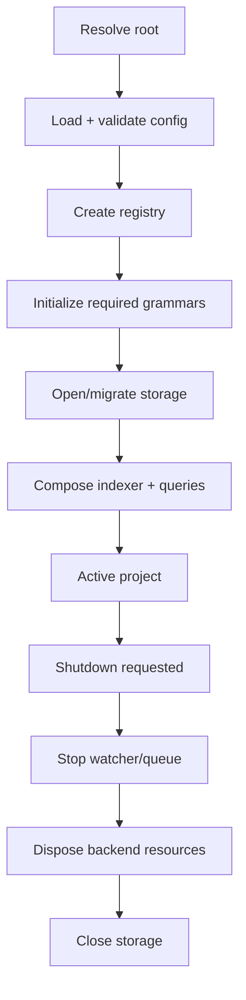

# Project lifecycle

Status: mixed
Baseline: `8c6e9ad004a491886fb396cddca0dd617c67f495`
Canonical owner: project composition

## Purpose

Define how one repository becomes an open Astrograph instance and who owns every resource until shutdown.

## Current behavior (AS-IS)

`openProject(rootPath, opts)` in `packages/core/src/adapters/bun/project.ts`:

1. Normalizes the project root and creates `.astrograph/` unconditionally.
2. Opens the configured/default SQLite path and runs migrations.
3. Creates hasher, query builder and filesystem adapters.
4. Builds the default registry from config.
5. Initializes Tree-sitter and loads the registry's required grammars.
6. Creates a glob scanner covering every *shipped* backend's extensions, enabled or not.
7. Creates `Indexer` and `GraphQueries`.
8. Returns an `Astrograph` facade.

```mermaid
sequenceDiagram
    participant Caller
    participant Project as openProject
    participant DB as BunSqliteStorageAdapter
    participant Registry as LanguageRegistry
    participant TS as Tree-sitter runtime
    participant Core as Astrograph

    Caller->>Project: openProject(root, options)
    Project->>Project: normalize root; mkdir .astrograph
    Project->>DB: open(dbPath); runMigrations()
    Project->>Registry: createDefaultRegistry(config)
    Project->>TS: initTreeSitter(); loadGrammars(required)
    Project->>Project: create glob, Indexer, GraphQueries
    Project-->>Caller: new Astrograph(...)
    Caller->>Core: index/query/sync
    Caller->>Core: close()
    Core->>DB: close()
```

The CLI finds a project by walking ancestors for `.astrograph`, except initialization which creates it. MCP uses explicit path, client roots, then cwd, and requires an existing index. Config loading occurs in the transport before `openProject`.

### What the scanner covers

The scan list is `registry.allExtensions()` **union** `shippedBackendExtensionOwners()` — deliberately
wider than the enabled backends. A disabled backend's files must still be *seen* so that
`classifyPath` can return `backend_disabled` and `eligibilityEvidence` can record the actionable
`NO_BACKEND` message; when the scanner omitted those extensions, membership saw a persisted path
missing from the scan set, classified it `out_of_scope`, and — since `out_of_scope` is not
recordable — deleted the row. A project whose entire PHP half was unindexed then answered every
query with `partial: false`.

Widening the scan does not widen parsing. Such a path is ineligible, is recorded with zero nodes, and
reaches neither `extractNodes` nor `loadProject` (contracts §13). `Indexer.indexableExtensions()`
still reports only the enabled backends' extensions, because that answers a different question: what
this configuration can actually index.

### The initialization seam

`openProject` delegates to `openProjectWithDependencies(rootPath, opts, dependencies)`, where
`OpenProjectDependencies` names the three composition steps a test may replace:

| Hook | Default | Why it is replaceable |
|---|---|---|
| `createStorage(path)` (required) | `new BunSqliteStorageAdapter(path)` | Observes that a failure after the handle exists closes it exactly once (AG-209). |
| `createRegistry(options)` | `createDefaultRegistry` | Lets a pipeline fixture register a backend whose Pass A fails, throws, or owns an extension tree-sitter has no grammar for — failure modes with no other deterministic trigger (AG-306). |
| `loadGrammars(registry)` | `initTreeSitter()` then `loadGrammars(grammarsForRegistry(registry))` | Lets a fixture exercise a grammar-runtime initialization failure without mutating the process-global grammar cache, which would leak into every other test in the run. |

Two properties are deliberate. **Every hook defaults to production**, so an override changes one step
and leaves Indexer phases, SQLite persistence and `GraphQueries` untouched — which is what makes a
fixture's result a statement about the shipped pipeline. And **`openProjectWithDependencies` is
exported from no barrel**: neither `packages/core/src/index.ts` nor
`packages/core/src/adapters/bun/index.ts` re-exports it, because a consumer able to swap the registry
would also be able to claim capabilities the shipped backends do not have. The ownership contract is
unchanged: everything after the storage handle exists must either hand ownership to `Astrograph` or
give the handle back.

Nothing here is a dependency-injection container. There is no registration, no resolution and no
lifetime management — three optional function properties on one interface, consumed once.

## Target behavior (TO-BE)

Opening a graph must have an explicit side-effect contract: read-only/eval opens with an external `dbPath` should not create state under the target repository unless requested. Configuration parsing and validation should be shared across transports. Shutdown should dispose freshness/watch resources and each backend before storage.



## Invariants

- Registry and scanner use the same extension set.
- `GraphQueries` receives the status of the same registry used by the indexer.
- Storage migrations complete before services access tables.
- A close operation is idempotent at the facade boundary.
- Configuration has one validated representation for CLI and MCP.

## Failure and partial states

- Invalid project root: CLI/MCP return a surface-specific error before opening storage.
- Invalid config: fail with the config path and actionable field error.
- Missing grammar: backend remains visible in status with `grammarsUnavailable`; affected extraction records honest errors.
- Storage/migration failure: no partially composed facade is returned.
- Shutdown during sync: queue/watch stops accepting work before resources are released.

## Source evidence

- `packages/core/src/adapters/bun/project.ts`: composition root, `OpenProjectDependencies`, `openProjectWithDependencies`.
- `packages/core/src/adapters/bun/project.test.ts`, `packages/core/__fixtures__/pipeline/`: the seam's two consumers.
- `packages/core/src/astrograph.ts`: facade and close path.
- `packages/cli/src/root.ts`, `commands/shared.ts`: CLI root/config rules.
- `packages/mcp/src/project.ts`: MCP root/session lifecycle.
- `packages/core/src/freshness.ts`: watcher and queued sync lifecycle.

## Known deviations

`DEV-006` covers config validation; `DEV-013` covers backend disposal. Eval's repository-side `.astrograph` creation is part of `DEV-015`.

