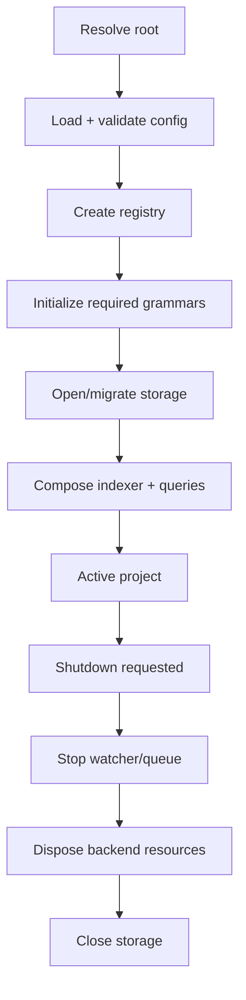

# Project lifecycle

Status: mixed
Baseline: `8c6e9ad004a491886fb396cddca0dd617c67f495`
Canonical owner: project composition

## Purpose

Define how one repository becomes an open Astrograph instance and who owns every resource until shutdown.

## Current behavior (AS-IS)

`openProject(rootPath, opts)` in `packages/core/src/adapters/bun/project.ts`:

1. Normalizes the project root and creates `.astrograph/` unconditionally.
2. Opens the configured/default SQLite path and runs migrations.
3. Creates hasher, query builder and filesystem adapters.
4. Builds the default registry from config.
5. Initializes Tree-sitter and loads the registry's required grammars.
6. Creates a backend-aware glob scanner.
7. Creates `Indexer` and `GraphQueries`.
8. Returns an `Astrograph` facade.

```mermaid
sequenceDiagram
    participant Caller
    participant Project as openProject
    participant DB as BunSqliteStorageAdapter
    participant Registry as LanguageRegistry
    participant TS as Tree-sitter runtime
    participant Core as Astrograph

    Caller->>Project: openProject(root, options)
    Project->>Project: normalize root; mkdir .astrograph
    Project->>DB: open(dbPath); runMigrations()
    Project->>Registry: createDefaultRegistry(config)
    Project->>TS: initTreeSitter(); loadGrammars(required)
    Project->>Project: create glob, Indexer, GraphQueries
    Project-->>Caller: new Astrograph(...)
    Caller->>Core: index/query/sync
    Caller->>Core: close()
    Core->>DB: close()
```

The CLI finds a project by walking ancestors for `.astrograph`, except initialization which creates it. MCP uses explicit path, client roots, then cwd, and requires an existing index. Config loading occurs in the transport before `openProject`.

## Target behavior (TO-BE)

Opening a graph must have an explicit side-effect contract: read-only/eval opens with an external `dbPath` should not create state under the target repository unless requested. Configuration parsing and validation should be shared across transports. Shutdown should dispose freshness/watch resources and each backend before storage.



## Invariants

- Registry and scanner use the same extension set.
- `GraphQueries` receives the status of the same registry used by the indexer.
- Storage migrations complete before services access tables.
- A close operation is idempotent at the facade boundary.
- Configuration has one validated representation for CLI and MCP.

## Failure and partial states

- Invalid project root: CLI/MCP return a surface-specific error before opening storage.
- Invalid config: fail with the config path and actionable field error.
- Missing grammar: backend remains visible in status with `grammarsUnavailable`; affected extraction records honest errors.
- Storage/migration failure: no partially composed facade is returned.
- Shutdown during sync: queue/watch stops accepting work before resources are released.

## Source evidence

- `packages/core/src/adapters/bun/project.ts`: composition root.
- `packages/core/src/astrograph.ts`: facade and close path.
- `packages/cli/src/root.ts`, `commands/shared.ts`: CLI root/config rules.
- `packages/mcp/src/project.ts`: MCP root/session lifecycle.
- `packages/core/src/freshness.ts`: watcher and queued sync lifecycle.

## Known deviations

`DEV-006` covers config validation; `DEV-013` covers backend disposal. Eval's repository-side `.astrograph` creation is part of `DEV-015`.

