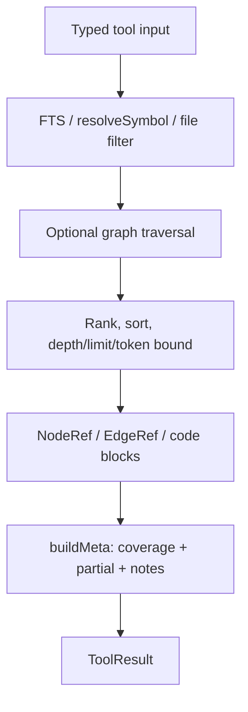
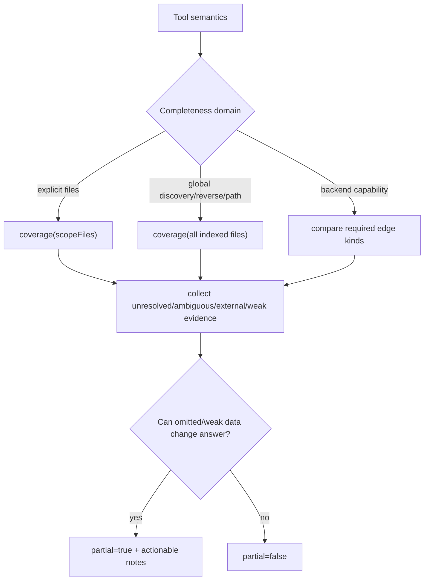

# Query and honesty model

Status: mixed
Baseline: `8c6e9ad004a491886fb396cddca0dd617c67f495`
Canonical owner: query layer

## Purpose

Define how stored graph evidence becomes tool answers and how each tool communicates uncertainty, coverage, ambiguity, and backend capability.

## Current behavior (AS-IS)

`GraphQueries` implements the ten read tools. `Astrograph` delegates to it, and CLI/MCP format the resulting `ToolResult<T>`.

| Tool | Primary mechanism | Completeness shape |
|---|---|---|
| search | SQLite FTS + deterministic ordering | global |
| context | FTS seeds + two-hop graph traversal + ranking | global discovery, bounded output |
| getNode | symbol lookup + caller/callee previews | mixed local/global |
| callers | incoming `calls` edges | global reverse |
| callees | outgoing `calls`/`instantiates` | local to source, but unresolved evidence matters |
| impact | bounded incoming traversal | global reverse |
| trace | bounded outgoing path search | global path |
| explore | term lookup grouped into files | global discovery |
| files | file table filtering/tree shaping | scoped by explicit path/pattern |
| status | aggregate DB/backend state | global status |

Symbol lookup is deterministic but may select a best candidate while noting ambiguity. Context combines normalized FTS, centrality, export/generated/test weighting, and graph proximity. Traversals are bounded to protect response size.

## Target behavior (TO-BE)

Every tool declares its completeness domain. `buildMeta` receives that domain explicitly instead of deriving it from only the returned rows.

A negative answer such as “no callers” or “no path” has a higher honesty burden than a positive answer. If pending files or unresolved edges could change it, it is partial.

## Invariants

- Sorting and limits are deterministic.
- Ambiguity is visible even when one candidate is selected.
- Unresolved and low-confidence evidence relevant to an answer is not silently filtered from metadata.
- Backend capabilities explain structurally unavailable edge kinds.
- Code slices are bounded and use repo-relative locations.
- `partial=false` means omitted work cannot change the claim within the documented domain.

## Failure and partial states

- Symbol absent: throw a typed core error, translated by the surface.
- Symbol ambiguous: choose deterministically and include a note/candidates.
- Capability absent: return partial with a backend capability note rather than an authoritative empty list.
- Coverage incomplete: include counts and up to the envelope's pending-file limit.
- Target-null edge: omit from node-shaped payload when necessary but retain its effect in notes.

## Source evidence

- `packages/core/src/query/graph-queries.ts`: tool orchestration and ranking.
- `packages/core/src/query/meta.ts`: envelope construction.
- `packages/core/src/graph/symbol-lookup.ts`, `traversal.ts`: lookup and traversal.
- `packages/core/src/db/queries.ts`, `search/fts-query.ts`: FTS and storage reads.

## Known deviations

`DEV-004` and `DEV-005` identify false-complete and hidden-unresolved cases.

