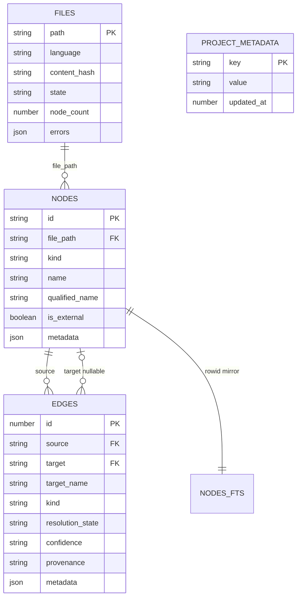
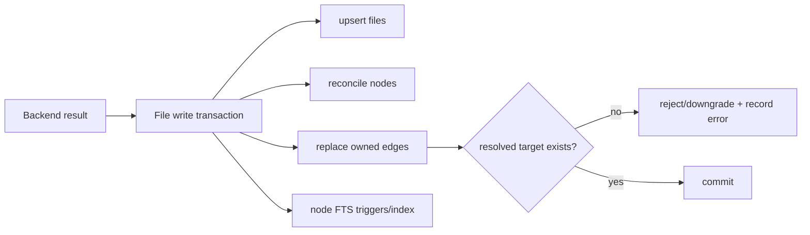

# Storage and graph model

Status: mixed
Baseline: `8c6e9ad004a491886fb396cddca0dd617c67f495`
Canonical owner: storage and graph contract

## Purpose

Describe the persisted model, its trust fields, and the transaction boundaries used by indexing and queries.

## Current behavior (AS-IS)

The Bun adapter uses SQLite in WAL mode. `runMigrations` creates/updates the schema; `QueryBuilder` is the only general SQL access layer. Files own project nodes, nodes own outgoing edges through foreign keys, and FTS mirrors searchable node text.

`target` is nullable for unresolved or intentionally unpersisted external references. `targetName` preserves the textual identity. Node IDs are deterministic hashes; edge IDs are storage row IDs and are not part of the normalized graph contract.

## Target behavior (TO-BE)

The schema remains transport- and language-neutral. It must support graph convergence and honest negative answers before adding new denormalized performance structures. Migrations must preserve existing indexes or explicitly declare rebuild requirements.

## Invariants

- Project node IDs are stable for an unchanged declaration identity.
- Resolved targets never dangle.
- External nodes cannot persist unsafe absolute paths outside the project boundary.
- Deleting a project file removes its owned nodes/outgoing edges transactionally.
- Coverage counts come from `files.state`, not inferred node/edge totals.
- `files.state` is lifecycle only. It is never read as a trust signal, and `resolved` does not imply a complete answer.
- Every persisted diagnostic carries a code from the versioned registry; no code of behavior reads an error `message`.
- `configHash` includes every behavior-affecting backend/grammar version key, plus the diagnostic registry version.

## Lifecycle state versus trust

Two independent axes are persisted on the same `files` row, and they answer different questions.

| Axis | Column | Question | Primitive |
|---|---|---|---|
| Lifecycle | `files.state` | How far did the pipeline get? | `getCoverage()` |
| Trust | `files.errors` (JSON) | Is what we know good enough? | `getFilesWithCoverageGap()`, `getFilesWithDiagnosticCategory()`, `getDiagnosticCounts()` |

A `resolved` file with a `TREE_SITTER_GRAMMAR_MISSING` diagnostic is the canonical case: every
phase ran to completion and the file's symbols are still absent. Reporting it as complete is how a
graph produces a confident empty result.

The category is **derived, not stored in a column**. `packages/core/src/diagnostics.ts` holds the
exhaustive `code → { category, degradesCompleteness }` table, and
`DIAGNOSTIC_REGISTRY_VERSION` feeds `configHash`. Deriving keeps re-categorization out of the
migration path: changing what a code means bumps the identity and rebuilds, rather than requiring a
schema change and a data migration over historical rows.

Stale diagnostics are cleared by re-derivation, not by a separate sweep. `Indexer.writeParsedFile`
deletes and rewrites the whole file record whenever Pass A runs, so a file that stops being
oversized loses its `FILE_TOO_LARGE` evidence in the same transaction that gives it real nodes.

## Resolution representation

| State | Target | Meaning |
|---|---|---|
| resolved | project node ID | One target identified by the backend's authority. |
| external | external ID or null | Target exists outside project; null is allowed for path hygiene. |
| ambiguous | chosen/best ID or null | Multiple candidates remain; metadata carries candidates when available. |
| unresolved | null | No safe target; textual `targetName` is retained when known. |

Confidence is orthogonal; a resolved edge can be medium confidence, and an external edge is not an error.

## Source evidence

- `packages/core/src/db/schema.sql`, `migrations.ts`, `queries.ts`.
- `packages/core/src/types.ts`: `Node`, `Edge`, `FileRecord`, coverage and adapter contracts.
- `packages/core/src/testing/normalize.ts`: normalized graph boundary.

## Known deviations

Full-index convergence and unsafe healing affect persisted truth (`DEV-001`, `DEV-003`). Migration compatibility requires a separate focused audit before schema changes.

