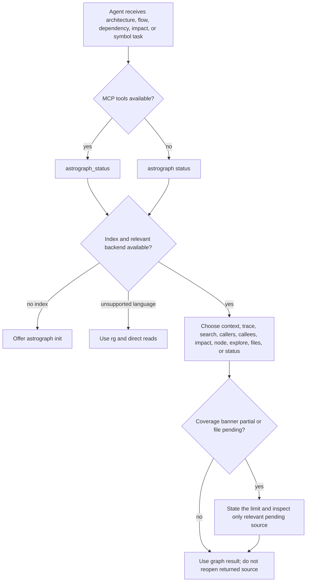

# Agent skill surface

Status: mixed
Baseline: `8c6e9ad004a491886fb396cddca0dd617c67f495`
Canonical owner: `agents/astrograph/SKILL.md` and `packages/cli/src/install/agent-guide.ts`

## Purpose

The agent skill is portable operating guidance, not a graph API. It tells a compatible coding agent when Astrograph is useful, how to choose an MCP tool or CLI command, how to interpret coverage, and when literal file inspection is still necessary. The installer distributes that guidance alongside host MCP configuration.

## Current behavior (AS-IS)

The canonical source is `agents/astrograph/SKILL.md`. It establishes a decision order: check status/freshness, use MCP when available, use the matching CLI command otherwise, prefer the graph for structural questions, and fall back to literal reads only for uncovered languages, partial/pending files, raw text outside the graph model, or an unsuccessful focused retry.

The guide accurately limits shipped backend support to JS/TS-family extensions and PHP. It calls out that Python, Go, Rust, Java, and other unregistered extensions are not indexed. It also tells agents that returned code blocks are already read and that coverage/partiality must constrain claims made to users.

The CLI installer embeds the canonical Markdown at build time. `install` chooses target adapters and a scope, writes the host MCP entry if missing, and installs either an embedded copy or an external symlink if `ASTROGRAPH_AGENT_GUIDE` is set. `uninstall` removes only guide files that match the embedded content or are symlinks; a pre-existing non-Astrograph guide is skipped. Targets with an `agentGuide` location currently include Claude Code, Cursor, Codex global scope, and opencode through their target definitions.

### Source evidence

| Concern | Evidence |
|---|---|
| Agent decision guidance and language boundary | `agents/astrograph/SKILL.md` |
| Build-time embedded source | `packages/cli/src/install/agent-guide.ts` import with `type: "text"` |
| Idempotent guide install/remove | `installAgentGuide`, `uninstallAgentGuide`, `isAgentGuideInstalled` in the same module |
| Host guide locations | `packages/cli/src/install/target.ts`, `packages/cli/src/install/targets/*` |
| MCP installation orchestration | `packages/cli/src/commands/install.ts`, `uninstall.ts` |

## Invariants

- The skill advises; MCP/CLI contracts and core results remain authoritative.
- Guidance must not claim coverage for an extension no registered backend owns.
- A returned source block is treated as read unless coverage makes it unsafe to rely on.
- Installer updates are idempotent and must not overwrite unrelated host instruction content.
- The distributed embedded copy must equal the canonical guide source unless an explicit external source is selected.
- Installing a guide does not create an index, alter repository source, or replace the Astrograph binary.

## Failure and partial states

| Condition | Agent or installer behavior |
|---|---|
| No MCP server available | use matching CLI command if installed |
| No `.astrograph/` index | offer/init rather than pretending graph data exists |
| Extension not claimed by a backend | use direct search/read; do not treat an empty graph result as absence of code |
| Partial coverage/pending file | declare uncertainty and inspect only affected source |
| External guide source missing | installer returns `skipped` with a reason |
| Existing non-Astrograph guide | installer returns `skipped`; it is preserved |
| Unsupported host scope | installer reports it as skipped rather than writing a guessed location |

## Reusable versus specific parts

| Reusable | Host/runtime-specific |
|---|---|
| Tool-choice vocabulary, coverage discipline, language-support boundary, agent workflow | Codex/Claude/Cursor/opencode guide paths, JSON/TOML/JSONC config placement, symlink behavior, environment variable source selection |
| Markdown guide source | Bun text import and filesystem install implementation |

## Target behavior (TO-BE)

The guide should remain concise, factual, and generated from the same capability vocabulary as `astrograph_status` and the MCP tool registry. It should teach honest use of partial results without duplicating unstable architecture details. Adding a language backend must update the support table, registry/status evidence, relevant extraction docs, and this guide in the same review. Host adapters may evolve, but the portable guidance should not encode a host-specific configuration format.

## Known deviations

- [DEV-004](../deviations.md) and [DEV-005](../deviations.md) — the guide correctly asks agents to trust the envelope, but some current envelopes can understate global incompleteness or hide unresolved evidence.
- [DEV-006](../deviations.md) — config diagnostics differ by transport, so the guide cannot promise uniform configuration failure messages.

## Related documents

- [MCP surface](mcp.md)
- [CLI surface](cli.md)
- [Query and honesty](../query-and-honesty.md)
- [Extension guide](../extension-guide.md)
- [Agent guide source](../../../agents/astrograph/SKILL.md)
