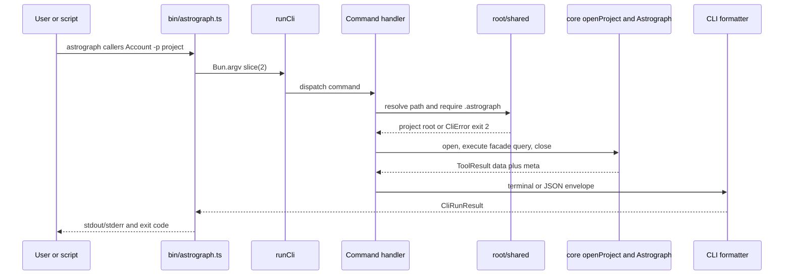

# CLI surface

Status: mixed
Baseline: `8c6e9ad004a491886fb396cddca0dd617c67f495`
Canonical owner: `packages/cli`

## Purpose

The CLI is the human and script-facing adapter. It owns argument parsing, project-root discovery, lifecycle command policy, terminal/JSON presentation, exit codes, and host installation. It does not own graph extraction, resolution, storage queries, or language-specific behavior; those belong to `@astrograph/core`.

## Current behavior (AS-IS)

`runCli` dispatches one command per process and translates `CliError` or unexpected errors to `CliRunResult` (`exitCode`, stdout, stderr). The binary writes that result and sets the process exit code. The command families are:

| Family | Commands | Core responsibility |
|---|---|---|
| Lifecycle | `init`, `uninit`, `index`, `sync`, `status`, `unlock`, `stop`, internal `daemon` | Create, update, observe, or remove a project index |
| Read | `search`/`query`/`q`, `context`, `trace`, `callers`, `callees`, `impact`, `node`, `explore`, `files` | Open the existing graph, invoke one facade method, format its `ToolResult` |
| Integration | `serve --mcp`, `install`, `uninstall` | Start MCP or edit host-owned integration config/guides |

Read commands resolve the nearest ancestor containing `.astrograph/`; `withGraph` opens the Bun-backed project with optional JSON config, executes exactly one callback, then closes it. `--json` serializes the complete core `ToolResult` envelope; human formatters render its data plus coverage/partiality footer. `--fail-on-partial` maps a partial envelope to exit code `3`; normal missing-index detection is exit code `2`.

`init` is the only CLI command that may create `.astrograph/` before opening a graph. `index` and `sync` reject an active daemon so normal CLI mutation and daemon mutation do not race. `init --detached` delegates initial indexing and watching to the daemon. `serve --mcp` transfers control to `@astrograph/mcp` and deliberately writes no CLI banner to standard output.

The installer is a separate adapter layer. Per-host `Target` implementations own path, format, merge/remove, and optional agent-guide location. It supports Claude Code, Cursor, Codex, and opencode; it can materialize the embedded guide or symlink an external guide selected with `ASTROGRAPH_AGENT_GUIDE`.

### Source evidence

| Concern | Evidence |
|---|---|
| Dispatch/error envelope | `packages/cli/src/cli.ts` `runCli`, `CliError`, `failOnPartial` |
| Process boundary | `packages/cli/src/bin/astrograph.ts` |
| Root and read lifecycle | `packages/cli/src/root.ts`; `packages/cli/src/commands/shared.ts` `openGraphForRead`, `withGraph` |
| Indexing policy | `packages/cli/src/commands/init.ts`, `index.ts`, `sync.ts` |
| MCP handoff | `packages/cli/src/commands/serve.ts` |
| Installation adapters | `packages/cli/src/install/target.ts`, `targets/*`, `agent-guide.ts` |

## Invariants

- Graph semantics originate in the core facade; CLI handlers only adapt inputs and outputs.
- Commands that require an index must not implicitly index a project.
- A normal CLI `index` or `sync` must not run while the project daemon is active.
- A read graph is closed in `withGraph` even when its callback fails.
- `--json` serializes the same envelope used by terminal formatters; partiality is never dropped.
- Installer removal changes only Astrograph-owned MCP entries and guide files it recognizes.

## Failure and partial states

| Condition | Current result |
|---|---|
| Unknown command or malformed flags | `CliError`, exit `1` |
| No ancestor `.astrograph/` for an existing-index command | clear init instruction, exit `2` |
| Invalid `config.json` when opened through shared CLI path | `CliError`, exit `1` |
| Daemon active for `index`/`sync`/synchronous `init` | clear stop instruction, exit `1` |
| Query envelope has `meta.partial` | formatted coverage/footer; exit `3` only with `--fail-on-partial` |
| Existing non-Astrograph agent guide | installer skips it rather than overwriting it |

## Reusable versus specific parts

| Reusable | Surface/runtime-specific |
|---|---|
| `Astrograph` facade, `ToolResult`, `AstrographConfig`, query inputs, graph lifecycle | Bun entrypoint, terminal styles, argument parser, POSIX process/daemon controls, host config writers |
| `LanguageRegistry` and all backend behavior | CLI aliases, help text, exit code policy, interactive installation prompt |

## Target behavior (TO-BE)

The target surface remains a thin, scriptable facade over core, as defined by `ROADMAP.md` and `docs/contracts.md`. It must expose only implemented tools and language support, carry coverage information through every output mode, and keep index mutation serialized. Configuration parsing/validation should be shared with MCP so identical project config produces identical diagnostics and behavior across transports.

## Known deviations

- [DEV-006](../deviations.md) — configuration is cast rather than semantically validated; CLI wraps parse errors but MCP does not provide the same diagnostic path.
- [DEV-017](../deviations.md) — static-quality cleanup remains separate from this documentation work.

## Related documents

- [Project lifecycle](../project-lifecycle.md)
- [Configuration and invalidation](../configuration-and-invalidation.md)
- [Query and honesty](../query-and-honesty.md)
- [MCP surface](mcp.md)
- [Agent skill](agent-skill.md)
- [CLI guide](../../cli.md)
