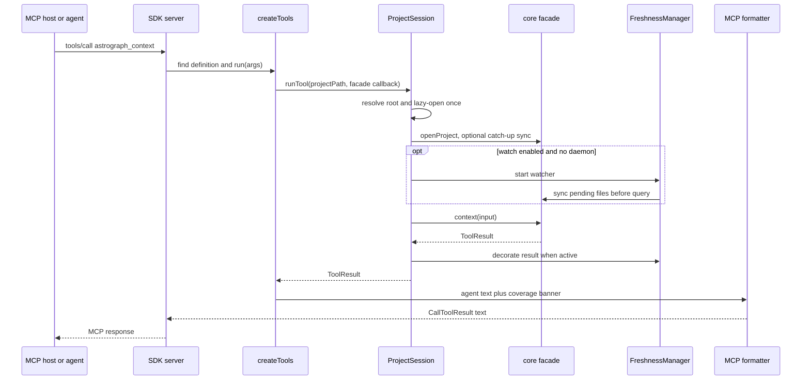

# MCP surface

Status: mixed
Baseline: `8c6e9ad004a491886fb396cddca0dd617c67f495`
Canonical owner: `packages/mcp`

## Purpose

The MCP package exposes Astrograph through the official stdio Model Context Protocol. It maps validated tool arguments to the core facade, renders agent-oriented text, manages one lazy project session, and optionally keeps that session fresh with a watcher. It does not implement graph logic or branch on a language backend.

## Current behavior (AS-IS)

`createAstrographMcpServer` creates an SDK `Server` with ten tools and server instructions. `serveMcp` connects it to `StdioServerTransport`; standard output is protocol-only. A `ProjectSession` is lazy: on the first call it resolves a path in this order — explicit `projectPath`, configured server path, first client root URI, then server cwd — and walks upward for `.astrograph/`.

On opening, the session parses `.astrograph/config.json` through the shared core parser before opening the project, and runs a catch-up `graph.sync()` only when no active daemon is recorded. With watch enabled (the default for `serveMcp`), it starts `FreshnessManager` after opening; before each tool it applies pending changes and decorates the core result with freshness state.

The registered tools correspond one-to-one with facade methods: `astrograph_search`, `context`, `trace`, `callers`, `callees`, `impact`, `node`, `explore`, `files`, and `status`. `tools.ts` owns simple runtime input checking, rejects unknown fields, and emits a text formatter per result type. `callTool` catches malformed input, missing index, and facade errors and returns an MCP `isError` text result rather than terminating the server.

The server instructions teach hosts to use graph tools before broad text search, treat returned source blocks as already read, check every coverage banner, and offer `astrograph init` if the index is absent. They are guidance; correctness still comes from the core envelope and the host decides whether to follow it.

### Source evidence

| Concern | Evidence |
|---|---|
| SDK server, stdio and shutdown | `packages/mcp/src/server.ts` `createAstrographMcpServer`, `serveMcp` |
| Root resolution, lazy open, catch-up, watcher | `packages/mcp/src/project.ts` `ProjectSession` |
| Tool schemas and facade mapping | `packages/mcp/src/tools.ts` `createTools`, parsers, `callFacade` |
| Agent-oriented text outputs | `packages/mcp/src/format/*` |
| Host guidance | `packages/mcp/src/instructions.ts` |
| Active-daemon detection | `packages/mcp/src/daemon.ts` |

## Invariants

- One `ProjectSession` owns at most one opened project graph per MCP server process.
- Missing `.astrograph/` is an explicit error; MCP never indexes implicitly on connection.
- Tool definitions do not depend on a specific programming language; the backend registry determines coverage.
- The MCP layer delegates graph queries to `AstrographCore` and formats their `ToolResult`; it does not invent edges or resolution.
- Stdio carries MCP protocol only; diagnostics must be represented by tool responses.
- Session close shuts freshness before closing the graph; SIGINT/SIGTERM use that close path.

## Failure and partial states

| Condition | Current result |
|---|---|
| Unknown tool | MCP text error `Unknown Astrograph tool` |
| Invalid argument shape/type | MCP text error from parser |
| Invalid JSON project config | MCP text error distinct from semantic validation |
| Semantically invalid project config | MCP text error including every core diagnostic code, JSON path, and message |
| Index absent | `MissingIndexError` tells the agent to run `astrograph init` |
| Client roots unavailable | session falls back to configured path or cwd |
| Active project daemon | no catch-up sync or in-session watcher; daemon remains freshness owner |
| Watch disabled | core answer is returned without watcher-specific decoration |
| Watcher start fails | the freshness manager marks the result partial and adds a watcher-unavailable note |
| Partial core answer | formatter retains coverage/partiality banner and notes |

## Reusable versus specific parts

| Reusable | Surface/runtime-specific |
|---|---|
| Core facade, input types, `ToolResult`, `FreshnessManager`, watcher interface | MCP SDK server, stdio transport, JSON schemas, MCP error envelope, agent text formatting |
| Project root and config semantics shared with CLI conceptually | Root URI selection, server instruction text, process signal handlers |

## Target behavior (TO-BE)

MCP remains a language-agnostic transport over the same core contract used by CLI. Every tool should expose the truthful coverage scope and unresolved/ambiguous evidence required by [Query and honesty](../query-and-honesty.md). Project config validation and errors converge with CLI through the shared core parser. Mature progressive indexing, multi-project serving, and a separate coverage tool remain outside the current baseline scope, consistent with `ROADMAP.md`.

## Known deviations

- [DEV-004](../deviations.md) and [DEV-005](../deviations.md) — the core can under-report partiality or omit unresolved evidence for some global queries; MCP faithfully formats that incomplete envelope and cannot correct it.
- [DEV-006](../deviations.md) — semantic parsing is shared; convergence invalidation remains to be proven separately.
- [DEV-013](../deviations.md) — close reaches the facade but backend lifecycle disposal is incomplete in core.

## Related documents

- [CLI surface](cli.md)
- [Agent skill](agent-skill.md)
- [Project lifecycle](../project-lifecycle.md)
- [Query and honesty](../query-and-honesty.md)
- [Configuration and invalidation](../configuration-and-invalidation.md)
- [MCP guide](../../mcp.md)
