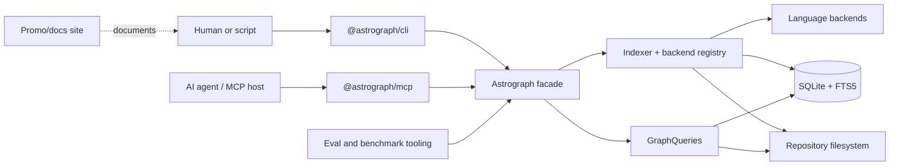

# System overview

Status: mixed
Baseline: `8c6e9ad004a491886fb396cddca0dd617c67f495`
Canonical owner: core architecture

## Purpose

Astrograph turns source files into a local, queryable symbol graph. The reusable product is the core facade and graph contract; CLI and MCP are transports, while language backends are replaceable producers behind a registry.

## Boundaries and responsibilities

| Boundary | Owns | Must not own |
|---|---|---|
| Core contract | Nodes, edges, tools, coverage, adapter interfaces | CLI formatting or MCP protocol |
| Bun adapters | Filesystem, glob, SQLite, watcher, project composition | Product query semantics |
| Registry/backend | File routing and extraction capability | Transport formatting |
| CLI | Argument parsing, commands, human/JSON output, daemon controls | Alternate graph semantics |
| MCP | Protocol schemas, project session, text formatting | Alternate graph semantics |
| Site | Product/docs presentation and installer hosting | Graph runtime |
| Eval/bench | Measurement | Production behavior |

## Current behavior (AS-IS)

`openProject` in `packages/core/src/adapters/bun/project.ts` composes concrete Bun adapters, the default backend registry, `Indexer`, and `GraphQueries`, then exposes them through `Astrograph`. The registry ships TypeScript and PHP backends. SQLite is the only persistence implementation.

The CLI opens this facade for one-shot commands or starts the MCP server. MCP maintains a `ProjectSession` which resolves a project root and lazily opens a graph. Both surfaces invoke the same `AstrographCore` methods.

## Target behavior (TO-BE)

Per `ROADMAP.md`, the architecture remains local-first and runtime-decoupled at the contract level. Tree-sitter is always the structural base; language-specific enrichers add semantic depth without deleting Pass A nodes. New languages are registered rather than added through conditionals in the core.

The target does not require multiple storage implementations, distributed indexing, cloud services, or a runtime 3D explorer.

## Invariants

- A repo-relative file is claimed by at most one registered backend.
- Project code never needs a remote service to index or query.
- CLI and MCP preserve the same structured tool result before formatting.
- Every answer has a `ToolMeta` envelope.
- Producer capability and coverage are not inferred from the language name.
- External paths must not leak build-machine absolute paths into the persisted graph.

## Failure and partial states

Initialization, grammar loading, source parsing, storage, and symbol lookup can fail independently. A parsing/resolution failure is stored against a file when possible. Missing coverage or capability changes the answer's metadata; it must not be formatted as an authoritative empty result.

## Reusable vs specific parts

Reusable: graph types, IDs, storage/query contracts, traversal, coverage metadata, registry and reconciliation. Bun-specific: concrete filesystem, glob, watcher and SQLite adapters. Language-specific: CST mapping and semantic/name resolution. Product-specific: CLI/MCP formatting, installer targets and site.

## Known deviations

See `DEV-004` through `DEV-008`, `DEV-013`, and `DEV-018` in [deviations](deviations.md).
